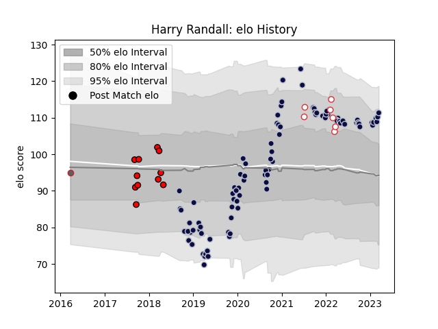

---  
layout: page  
title: Harry Randall  
date: 2023-03-16 19:48:16.735283  
categories: player  
---
# Harry Randall

## Positions: SH

## Country: England

## Current elo: 111.0

## Current Percentile: 87.0

# Elo History

# Match History

| Team             |   Appearances |   Win Rate |
|:-----------------|--------------:|-----------:|
| Bristol Rugby    |            92 |   0.570652 |
| Hartpury College |            11 |   0.318182 |
| England          |             7 |   0.571429 |
| Gloucester Rugby |             1 |   0        |

| Opponent                 |   Matches |   Win Rate |
|:-------------------------|----------:|-----------:|
| Exeter Chiefs            |         8 |   0.375    |
| Sale Sharks              |         8 |   0.4375   |
| Harlequins               |         8 |   0.5      |
| Wasps                    |         7 |   0.142857 |
| Saracens                 |         7 |   0.285714 |
| Leicester Tigers         |         7 |   0.571429 |
| Bath Rugby               |         6 |   0.833333 |
| Newcastle Falcons        |         6 |   0.666667 |
| Gloucester Rugby         |         6 |   0.666667 |
| Northampton Saints       |         5 |   0.8      |
| Worcester Warriors       |         4 |   0.75     |
| London Irish             |         4 |   0.625    |
| Zebre                    |         4 |   0.625    |
| Bristol Rugby            |         2 |   0        |
| La Rochelle              |         2 |   0        |
| Stade Francais Paris     |         2 |   1        |
| Brive                    |         2 |   1        |
| Rotherham Titans         |         1 |   1        |
| Yorkshire Carnegie       |         1 |   0.5      |
| Bordeaux Begles          |         1 |   1        |
| Wales                    |         1 |   1        |
| United States of America |         1 |   1        |
| Toulon                   |         1 |   1        |
| Scotland                 |         1 |   0        |
| Scarlets                 |         1 |   1        |
| Canada                   |         1 |   1        |
| France                   |         1 |   0        |
| Dragons                  |         1 |   1        |
| Perpignan                |         1 |   1        |
| Nottingham               |         1 |   0        |
| Clermont Auvergne        |         1 |   0        |
| Connacht                 |         1 |   1        |
| London Scottish          |         1 |   1        |
| Bedford                  |         1 |   0        |
| Cornish Pirates          |         1 |   0        |
| Jersey                   |         1 |   0        |
| Italy                    |         1 |   1        |
| Ireland                  |         1 |   0        |
| Doncaster                |         1 |   1        |
| Richmond                 |         1 |   0        |