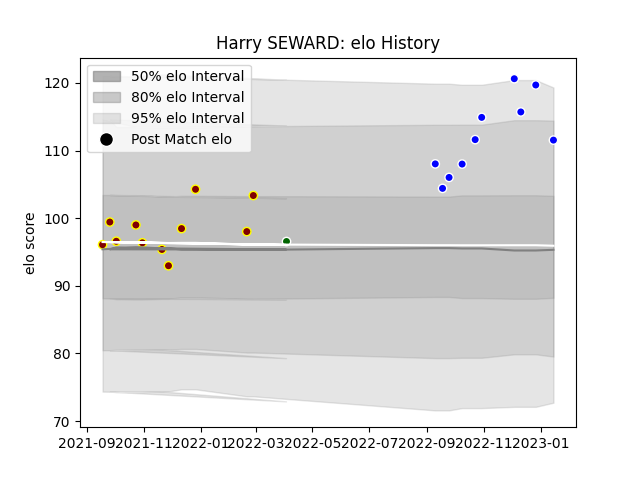

---  
layout: page  
title: Harry SEWARD  
date: 2023-01-23 15:34:52.463833  
categories: player  
---
# Harry SEWARD

## Positions: P

## Current elo: 112.0

## Current Percentile: 95.0

# Elo History

# Match History

| Team                |   Appearances |   Win Rate |
|:--------------------|--------------:|-----------:|
| Ampthill            |            11 |       0.5  |
| Coventry            |            10 |       0.75 |
| Ealing Trailfinders |             1 |       1    |

| Opponent         |   Matches |   Win Rate |
|:-----------------|----------:|-----------:|
| Hartpury College |         3 |   0.333333 |
| Jersey           |         3 |   0.333333 |
| Richmond         |         3 |   1        |
| Cornish Pirates  |         2 |   0.5      |
| Coventry         |         2 |   0.5      |
| Doncaster        |         2 |   0.5      |
| London Scottish  |         2 |   1        |
| Nottingham       |         2 |   0.5      |
| Ampthill         |         1 |   1        |
| Bedford          |         1 |   1        |
| Caldy            |         1 |   1        |