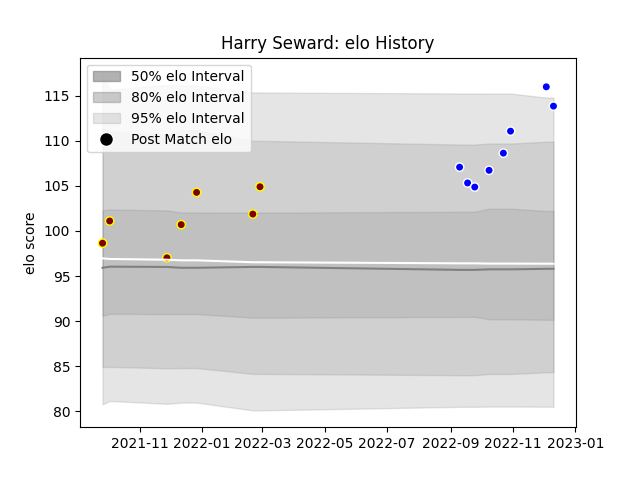

---  
layout: page  
title: Harry Seward  
date: 2022-12-18 16:35:19.055700  
categories: player  
---
# Harry Seward

## Positions: P

## Current elo: 114.0

## Current Percentile: 95.0

# Elo History

# Match History

| Team     |   Appearances |   Win Rate |
|:---------|--------------:|-----------:|
| Coventry |             8 |   0.75     |
| Ampthill |             7 |   0.571429 |

| Opponent         |   Matches |   Win Rate |
|:-----------------|----------:|-----------:|
| Hartpury College |         3 |   0.333333 |
| Cornish Pirates  |         2 |   0.5      |
| Coventry         |         2 |   0.5      |
| London Scottish  |         2 |   1        |
| Ampthill         |         1 |   1        |
| Bedford          |         1 |   1        |
| Caldy            |         1 |   1        |
| Doncaster        |         1 |   1        |
| Jersey           |         1 |   0        |
| Richmond         |         1 |   1        |