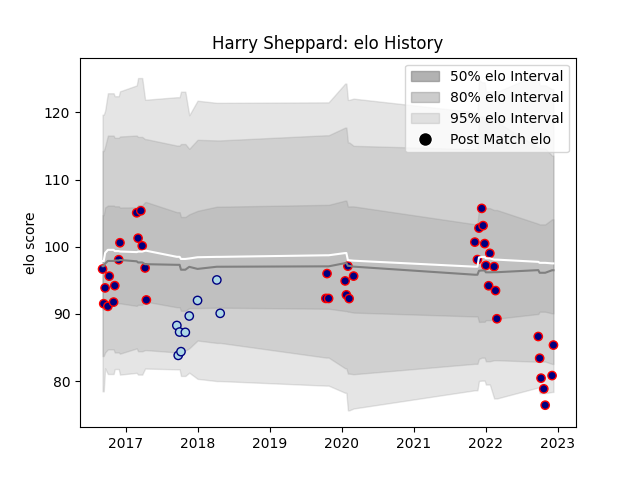

---  
layout: page  
title: Harry Sheppard  
date: 2023-01-06 00:14:10.909089  
categories: player  
---
# Harry Sheppard

## Positions: FH

## Current elo: 101.0

## Current Percentile: None

# Elo History

# Match History

| Team            |   Appearances |   Win Rate |
|:----------------|--------------:|-----------:|
| London Scottish |            49 |   0.204082 |
| Bedford         |            18 |   0.5      |

| Opponent            |   Matches |   Win Rate |
|:--------------------|----------:|-----------:|
| Doncaster           |         9 |   0.166667 |
| Nottingham          |         8 |   0.125    |
| Ealing Trailfinders |         7 |   0.142857 |
| Cornish Pirates     |         6 |   0.333333 |
| Ampthill            |         4 |   0.125    |
| Hartpury College    |         4 |   0.375    |
| Richmond            |         4 |   0.5      |
| Bedford             |         4 |   0.25     |
| Jersey              |         4 |   0.5      |
| Coventry            |         4 |   0.25     |
| Yorkshire Carnegie  |         3 |   0.333333 |
| London Irish        |         2 |   0        |
| London Scottish     |         2 |   0.75     |
| Rotherham Titans    |         2 |   1        |
| London Welsh        |         1 |   0        |
| Newcastle Falcons   |         1 |   0        |
| Caldy               |         1 |   1        |
| Bristol Rugby       |         1 |   0        |