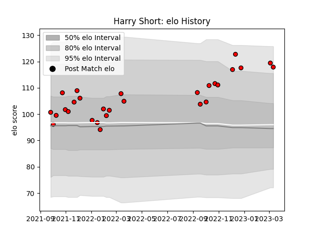

---  
layout: page  
title: Harry Short  
date: 2022-12-18 16:35:34.266598  
categories: player  
---
# Harry Short

## Positions: FL

## Current elo: 111.0

## Current Percentile: 86.0

# Elo History

# Match History

| Team             |   Appearances |   Win Rate |
|:-----------------|--------------:|-----------:|
| Hartpury College |            21 |    0.47619 |

| Opponent            |   Matches |   Win Rate |
|:--------------------|----------:|-----------:|
| Bedford             |         3 |   0.333333 |
| Nottingham          |         3 |   0.666667 |
| Richmond            |         3 |   0.333333 |
| Ampthill            |         2 |   1        |
| Coventry            |         2 |   1        |
| Doncaster           |         2 |   0        |
| Jersey              |         2 |   0        |
| Caldy               |         1 |   1        |
| Cornish Pirates     |         1 |   0        |
| Ealing Trailfinders |         1 |   0        |
| London Scottish     |         1 |   1        |