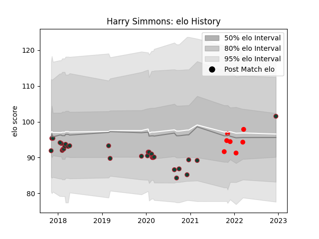

---  
layout: page  
title: Harry Simmons  
date: 2023-03-17 17:33:23.921037  
categories: player  
---
# Harry Simmons

## Positions: W, FB

## Current elo: 100.0

## Current Percentile: 70.0

# Elo History

# Match History

| Team             |   Appearances |   Win Rate |
|:-----------------|--------------:|-----------:|
| Leicester Tigers |            37 |   0.513514 |
| Jersey           |            11 |   0.590909 |

| Opponent            |   Matches |   Win Rate |
|:--------------------|----------:|-----------:|
| Bath Rugby          |         5 |   0.4      |
| Wasps               |         4 |   0.5      |
| Gloucester Rugby    |         3 |   0.666667 |
| Saracens            |         3 |   0.666667 |
| Sale Sharks         |         3 |   0.333333 |
| Worcester Warriors  |         3 |   0.666667 |
| Cardiff Blues       |         3 |   1        |
| Coventry            |         2 |   1        |
| Doncaster           |         2 |   0        |
| Bristol Rugby       |         2 |   0        |
| Ospreys             |         2 |   0.5      |
| Castres Olympique   |         1 |   0        |
| Northampton Saints  |         1 |   0        |
| Bayonne             |         1 |   1        |
| Bedford             |         1 |   0        |
| Richmond            |         1 |   1        |
| Pau                 |         1 |   0        |
| Nottingham          |         1 |   1        |
| London Irish        |         1 |   1        |
| Newcastle Falcons   |         1 |   0        |
| Clermont Auvergne   |         1 |   1        |
| Hartpury College    |         1 |   1        |
| Harlequins          |         1 |   1        |
| Exeter Chiefs       |         1 |   0        |
| Ealing Trailfinders |         1 |   0        |
| Cornish Pirates     |         1 |   1        |
| Ampthill            |         1 |   0.5      |