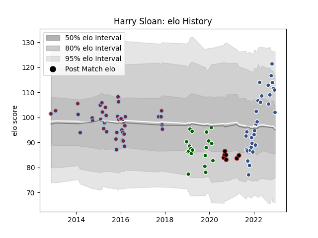

---  
layout: page  
title: Harry Sloan  
date: 2022-12-14 11:16:19.888009  
categories: player  
---
# Harry Sloan

## Positions: C

## Current elo: 112.0

## Current Percentile: 88.0

# Elo History

# Match History

| Team                |   Appearances |   Win Rate |
|:--------------------|--------------:|-----------:|
| Harlequins          |            41 |   0.560976 |
| Agen                |            28 |   0.446429 |
| Ealing Trailfinders |            19 |   0.815789 |
| Saracens            |             5 |   0.5      |

| Opponent            |   Matches |   Win Rate |
|:--------------------|----------:|-----------:|
| Worcester Warriors  |         6 |   0.666667 |
| Bath Rugby          |         5 |   0.5      |
| Gloucester Rugby    |         4 |   0.5      |
| Exeter Chiefs       |         4 |   0.25     |
| Wasps               |         4 |   0.75     |
| Sale Sharks         |         3 |   0.333333 |
| Jersey              |         3 |   1        |
| Grenoble            |         3 |   0.333333 |
| Coventry            |         3 |   0.833333 |
| Newcastle Falcons   |         3 |   0        |
| Northampton Saints  |         3 |   0.333333 |
| Saracens            |         3 |   0.666667 |
| Beziers             |         3 |   0        |
| Leicester Tigers    |         3 |   0.666667 |
| Narbonne            |         2 |   0.5      |
| Montpellier Herault |         2 |   0.5      |
| Oyonnax             |         2 |   0        |
| Mont-de-Marsan      |         2 |   0        |
| Provence Rugby      |         2 |   0.5      |
| Yorkshire Carnegie  |         2 |   1        |
| London Irish        |         2 |   1        |
| Rouen               |         2 |   1        |
| Doncaster           |         2 |   1        |
| Vannes              |         2 |   1        |
| Colomiers           |         2 |   0.5      |
| Cardiff Blues       |         2 |   0.5      |
| Calvisano           |         2 |   1        |
| Bedford             |         2 |   0.5      |
| Bayonne             |         2 |   0.25     |
| Hartpury College    |         2 |   1        |
| US Bressane         |         1 |   0        |
| Soyaux-Angouleme    |         1 |   0        |
| Aurillac            |         1 |   1        |
| Richmond            |         1 |   0        |
| Nottingham          |         1 |   1        |
| Montauban           |         1 |   1        |
| London Welsh        |         1 |   1        |
| Cornish Pirates     |         1 |   1        |
| Carcassonne         |         1 |   1        |
| Biarritz Olympique  |         1 |   1        |
| London Scottish     |         1 |   1        |