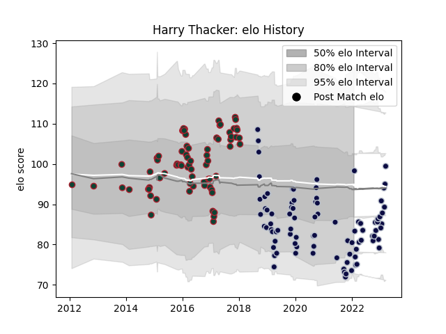

---  
layout: page  
title: Harry Thacker  
date: 2023-03-21 18:10:10.288397  
categories: player  
---
# Harry Thacker

Last updated: 2023-03-21
## Positions: H

## Current elo: 98.0

## Current Percentile: 12.0

# Elo History

# Match History

| Team             |   Appearances |   Win Rate |
|:-----------------|--------------:|-----------:|
| Bristol Rugby    |            89 |   0.516854 |
| Leicester Tigers |            74 |   0.641892 |

| Opponent             |   Matches |   Win Rate |
|:---------------------|----------:|-----------:|
| Saracens             |        15 |   0.3      |
| Northampton Saints   |        13 |   0.692308 |
| Harlequins           |        12 |   0.583333 |
| Gloucester Rugby     |        11 |   0.727273 |
| Bath Rugby           |        10 |   0.4      |
| Worcester Warriors   |        10 |   0.6      |
| Sale Sharks          |        10 |   0.55     |
| Exeter Chiefs        |        10 |   0.4      |
| Newcastle Falcons    |        10 |   0.7      |
| London Irish         |        10 |   0.75     |
| Wasps                |         8 |   0.125    |
| Leicester Tigers     |         7 |   0.5      |
| Stade Francais Paris |         4 |   0.75     |
| Munster              |         4 |   0.75     |
| Zebre                |         4 |   0.875    |
| Perpignan            |         2 |   1        |
| Bristol Rugby        |         2 |   1        |
| Brive                |         2 |   1        |
| Scarlets             |         2 |   0.5      |
| Racing 92            |         2 |   0        |
| La Rochelle          |         2 |   0        |
| Dragons              |         2 |   1        |
| Glasgow Warriors     |         2 |   0        |
| RC Enisei            |         1 |   1        |
| Ospreys              |         1 |   1        |
| London Welsh         |         1 |   1        |
| Cardiff Blues        |         1 |   1        |
| Toulon               |         1 |   1        |
| Ulster               |         1 |   1        |
| Benetton Treviso     |         1 |   1        |
| Bordeaux Begles      |         1 |   1        |
| Castres Olympique    |         1 |   0        |