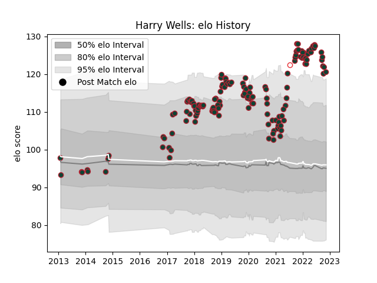

---  
layout: page  
title: Harry Wells  
date: 2023-03-17 17:32:07.402253  
categories: player  
---
# Harry Wells

## Positions: L, FL

## Country: England

## Current elo: 99.0

## Current Percentile: 99.0

# Elo History

# Match History

| Team             |   Appearances |   Win Rate |
|:-----------------|--------------:|-----------:|
| Leicester Tigers |           165 |   0.581818 |
| England          |             1 |   1        |

| Opponent            |   Matches |   Win Rate |
|:--------------------|----------:|-----------:|
| Bath Rugby          |        13 |   0.461538 |
| Sale Sharks         |        12 |   0.416667 |
| Northampton Saints  |        12 |   0.583333 |
| Harlequins          |        12 |   0.625    |
| Gloucester Rugby    |        12 |   0.833333 |
| Exeter Chiefs       |        11 |   0.363636 |
| Wasps               |        11 |   0.636364 |
| Saracens            |        11 |   0.363636 |
| Newcastle Falcons   |        11 |   0.818182 |
| London Irish        |        11 |   0.727273 |
| Worcester Warriors  |        11 |   0.636364 |
| Bristol Rugby       |         9 |   0.5      |
| Clermont Auvergne   |         3 |   1        |
| Ulster              |         3 |   0.333333 |
| Scarlets            |         3 |   0.333333 |
| Cardiff Blues       |         3 |   1        |
| Racing 92           |         3 |   0        |
| Ospreys             |         3 |   0.666667 |
| Connacht            |         2 |   1        |
| Pau                 |         2 |   0.5      |
| Canada              |         1 |   1        |
| Brive               |         1 |   1        |
| Montpellier Herault |         1 |   0        |
| Bayonne             |         1 |   1        |
| Toulon              |         1 |   0        |
| Castres Olympique   |         1 |   0        |
| Bordeaux Begles     |         1 |   1        |
| Dragons             |         1 |   1        |