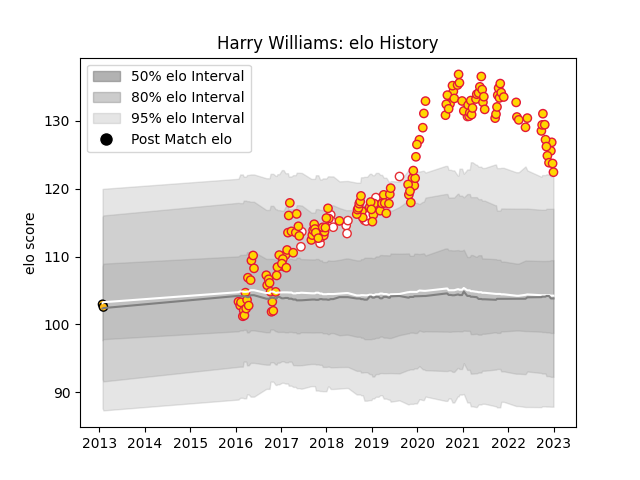

---  
layout: page  
title: Harry Williams  
date: 2023-01-06 00:21:55.958977  
categories: player  
---
# Harry Williams

## Positions: P

## Country: England

## Current elo: 122.0

## Current Percentile: 95.0

# Elo History

# Match History

| Team          |   Appearances |   Win Rate |
|:--------------|--------------:|-----------:|
| Exeter Chiefs |           151 |   0.701987 |
| England       |            19 |   0.684211 |
| Wasps         |             2 |   0        |

| Opponent            |   Matches |   Win Rate |
|:--------------------|----------:|-----------:|
| Sale Sharks         |        15 |   0.733333 |
| Leicester Tigers    |        13 |   0.615385 |
| Wasps               |        13 |   0.730769 |
| Northampton Saints  |        13 |   0.615385 |
| Bath Rugby          |        12 |   0.833333 |
| Worcester Warriors  |        11 |   0.909091 |
| Saracens            |        11 |   0.318182 |
| Gloucester Rugby    |        10 |   0.65     |
| Bristol Rugby       |         9 |   0.666667 |
| Harlequins          |         9 |   0.888889 |
| Newcastle Falcons   |         8 |   0.75     |
| London Irish        |         6 |   0.833333 |
| South Africa        |         4 |   0.5      |
| Argentina           |         3 |   1        |
| Wales               |         3 |   0.666667 |
| Glasgow Warriors    |         3 |   0.666667 |
| Castres Olympique   |         3 |   0.666667 |
| Scotland            |         2 |   0        |
| La Rochelle         |         2 |   1        |
| Leinster            |         2 |   0        |
| Australia           |         2 |   1        |
| Montpellier Herault |         2 |   1        |
| Munster             |         2 |   0.25     |
| Clermont Auvergne   |         2 |   0        |
| Ulster              |         2 |   0.5      |
| Bordeaux Begles     |         1 |   1        |
| Stade Toulousain    |         1 |   1        |
| Italy               |         1 |   1        |
| Bulls               |         1 |   1        |
| Samoa               |         1 |   1        |
| Racing 92           |         1 |   1        |
| Japan               |         1 |   1        |
| New Zealand         |         1 |   0        |
| Ireland             |         1 |   1        |
| Ospreys             |         1 |   1        |