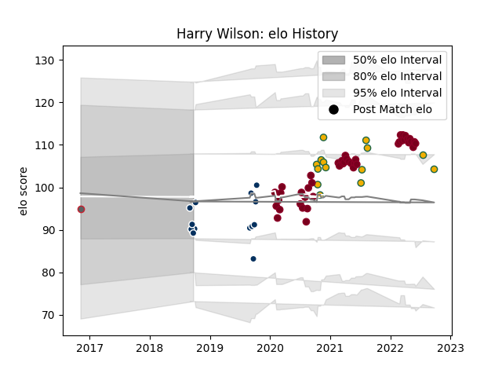

---  
layout: page  
title: Harry Wilson  
date: 2022-12-12 14:50:16.846479  
categories: player  
---
# Harry Wilson

## Positions: N8

## Country: Australia

## Current elo: 106.0

## Current Percentile: None

# Elo History

# Match History

| Team               |   Appearances |   Win Rate |
|:-------------------|--------------:|-----------:|
| Queensland Reds    |            44 |   0.579545 |
| Australia          |            14 |   0.285714 |
| Queensland Country |             9 |   0.444444 |
| Gloucester Rugby   |             1 |   1        |

| Opponent                 |   Matches |   Win Rate |
|:-------------------------|----------:|-----------:|
| Brumbies                 |         9 |   0.555556 |
| New Zealand              |         8 |   0.1875   |
| Melbourne Rebels         |         7 |   0.928571 |
| Western Force            |         6 |   0.666667 |
| New South Wales Waratahs |         6 |   0.833333 |
| Crusaders                |         4 |   0        |
| Argentina                |         3 |   0.5      |
| Chiefs                   |         2 |   0.5      |
| Fijian Drua              |         2 |   0.5      |
| France                   |         2 |   0.5      |
| Sydney Rays              |         2 |   0.5      |
| Hurricanes               |         2 |   0        |
| Brisbane City            |         2 |   0.5      |
| NSW Country Eagles       |         1 |   1        |
| Sunwolves                |         1 |   1        |
| Sharks                   |         1 |   0        |
| Saracens                 |         1 |   1        |
| Bulls                    |         1 |   1        |
| Melbourne Rising         |         1 |   0        |
| Moana Pasifika           |         1 |   1        |
| England                  |         1 |   0        |
| Canberra Vikings         |         1 |   1        |
| Lions                    |         1 |   0        |
| Blues                    |         1 |   0        |
| Highlanders              |         1 |   0        |
| Jaguares                 |         1 |   0        |