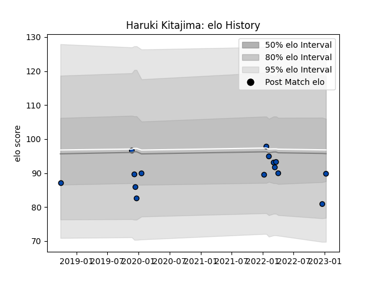

---  
layout: page  
title: Haruki Kitajima  
date: 2023-01-13 11:33:33.452495  
categories: player  
---
# Haruki Kitajima

## Positions: W

## Current elo: 90.0

## Current Percentile: 13.0

# Elo History

# Match History

| Team                |   Appearances |   Win Rate |
|:--------------------|--------------:|-----------:|
| Skyactivs Hiroshima |             9 |   0.111111 |
| Mazda Blue Zoomers  |             6 |   0.333333 |

| Opponent                        |   Matches |   Win Rate |
|:--------------------------------|----------:|-----------:|
| Hanazono Kintetsu Liners        |         3 |        0   |
| Kamaishi Seawaves               |         2 |        0.5 |
| Mitsubishi Dynaboars            |         2 |        0   |
| Chugoku Red Regulions           |         1 |        0   |
| Coca-Cola Red Sparks            |         1 |        0   |
| Hino Red Dolphins               |         1 |        0   |
| Kurita Water Gush               |         1 |        0   |
| Kyuden Voltex                   |         1 |        1   |
| Mie Honda Heat                  |         1 |        0   |
| NTT Docomo Red Hurricanes Osaka |         1 |        0   |
| Shimizu Blue Sharks             |         1 |        1   |