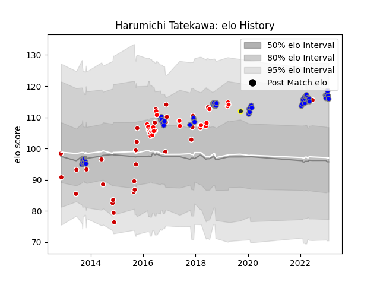

---  
layout: page  
title: Harumichi Tatekawa  
date: 2023-02-02 19:12:34.481716  
categories: player  
---
# Harumichi Tatekawa

## Positions: C, FH

## Country: Japan

## Current elo: 116.0

## Current Percentile: 88.0

# Elo History

# Match History

| Team                              |   Appearances |   Win Rate |
|:----------------------------------|--------------:|-----------:|
| Kubota Spears Funabashi Tokyo-Bay |            49 |   0.693878 |
| Japan                             |            30 |   0.583333 |
| Sunwolves                         |            25 |   0.1      |
| Otago                             |             1 |   0        |

| Opponent                         |   Matches |   Win Rate |
|:---------------------------------|----------:|-----------:|
| Yokohama Canon Eagles            |         5 |   0.7      |
| Georgia                          |         5 |   0.8      |
| Green Rockets Tokatsu            |         5 |   0.7      |
| Toshiba Brave Lupus Tokyo        |         4 |   0.5      |
| Saitama Wild Knights             |         4 |   0        |
| Melbourne Rebels                 |         4 |   0        |
| Uruguay                          |         3 |   1        |
| Shizuoka Blue Revs               |         3 |   0.333333 |
| Scotland                         |         3 |   0        |
| Toyota Verblitz                  |         3 |   0.333333 |
| Munakata Sanix Blues             |         3 |   1        |
| Mie Honda Heat                   |         3 |   1        |
| Urayasu D-Rocks                  |         3 |   1        |
| Lions                            |         3 |   0        |
| Hanazono Kintetsu Liners         |         3 |   0.666667 |
| Black Rams Tokyo                 |         3 |   1        |
| Wales                            |         3 |   0.333333 |
| Coca-Cola Red Sparks             |         3 |   1        |
| Cheetahs                         |         3 |   0        |
| Queensland Reds                  |         2 |   0        |
| Brumbies                         |         2 |   0        |
| Sharks                           |         2 |   0        |
| Bulls                            |         2 |   0        |
| Samoa                            |         2 |   1        |
| Romania                          |         2 |   1        |
| New Zealand Maori                |         2 |   0        |
| New South Wales Waratahs         |         2 |   0.5      |
| Tokyo Sungoliath                 |         2 |   0.5      |
| Kobelco Kobe Steelers            |         2 |   1        |
| Stormers                         |         2 |   0.25     |
| United States of America         |         1 |   1        |
| Western Force                    |         1 |   0        |
| Toyota Industries Shuttles Aichi |         1 |   1        |
| Wellington                       |         1 |   0        |
| Tonga                            |         1 |   1        |
| Argentina                        |         1 |   0        |
| Southern Kings                   |         1 |   0        |
| South Africa                     |         1 |   1        |
| Australia                        |         1 |   0        |
| NTT Docomo Red Hurricanes Osaka  |         1 |   1        |
| Jaguares                         |         1 |   1        |
| Italy                            |         1 |   1        |
| Hino Red Dolphins                |         1 |   1        |
| France                           |         1 |   0.5      |
| Fiji                             |         1 |   0        |
| Canada                           |         1 |   1        |
| New Zealand                      |         1 |   0        |