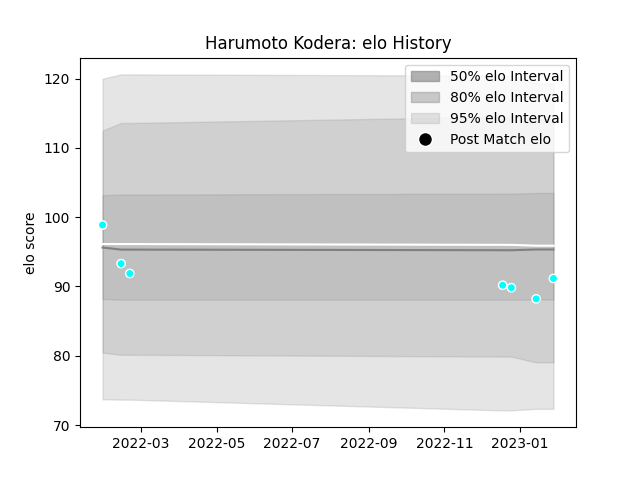

---  
layout: page  
title: Harumoto Kodera  
date: 2022-12-28 12:52:33.563389  
categories: player  
---
# Harumoto Kodera

## Positions: P

## Current elo: 92.0

## Current Percentile: 33.0

# Elo History

# Match History

| Team                             |   Appearances |   Win Rate |
|:---------------------------------|--------------:|-----------:|
| Toyota Industries Shuttles Aichi |             5 |          1 |

| Opponent              |   Matches |   Win Rate |
|:----------------------|----------:|-----------:|
| Shimizu Blue Sharks   |         2 |          1 |
| Chugoku Red Regulions |         1 |          1 |
| Hino Red Dolphins     |         1 |          1 |
| Kyuden Voltex         |         1 |          1 |