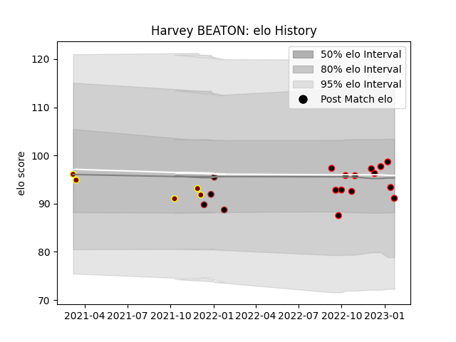

---  
layout: page  
title: Harvey BEATON  
date: 2023-01-13 11:22:39.853776  
categories: player  
---
# Harvey BEATON

## Positions: P

## Current elo: 99.0

## Current Percentile: 51.0

# Elo History

# Match History

| Team            |   Appearances |   Win Rate |
|:----------------|--------------:|-----------:|
| Cornish Pirates |            11 |   0.454545 |
| Ampthill        |             5 |   0        |
| Saracens        |             4 |   0.75     |

| Opponent            |   Matches |   Win Rate |
|:--------------------|----------:|-----------:|
| Ealing Trailfinders |         3 |        0   |
| Bedford             |         2 |        0   |
| Doncaster           |         2 |        0.5 |
| Hartpury College    |         2 |        0   |
| Ampthill            |         1 |        1   |
| Caldy               |         1 |        0   |
| Coventry            |         1 |        0   |
| Edinburgh           |         1 |        0   |
| Jersey              |         1 |        0   |
| London Irish        |         1 |        1   |
| London Scottish     |         1 |        1   |
| Northampton Saints  |         1 |        1   |
| Nottingham          |         1 |        1   |
| Richmond            |         1 |        1   |
| Worcester Warriors  |         1 |        1   |