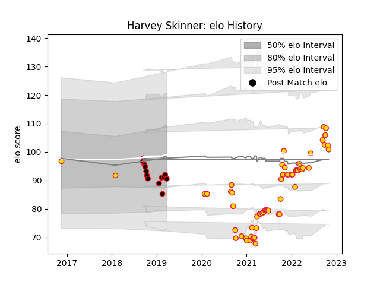

---  
layout: page  
title: Harvey Skinner  
date: 2023-01-06 11:42:53.628679  
categories: player  
---
# Harvey Skinner

## Positions: FH, C

## Current elo: 91.0

## Current Percentile: 19.0

# Elo History

# Match History

| Team            |   Appearances |   Win Rate |
|:----------------|--------------:|-----------:|
| Exeter Chiefs   |            61 |   0.622951 |
| Cornish Pirates |            13 |   0.384615 |

| Opponent            |   Matches |   Win Rate |
|:--------------------|----------:|-----------:|
| Worcester Warriors  |         7 |   0.714286 |
| Sale Sharks         |         7 |   0.571429 |
| Gloucester Rugby    |         6 |   0.666667 |
| Harlequins          |         6 |   0.666667 |
| London Irish        |         5 |   0.4      |
| Bristol Rugby       |         5 |   0.8      |
| Wasps               |         5 |   0.4      |
| Northampton Saints  |         5 |   0.6      |
| Newcastle Falcons   |         4 |   0.75     |
| Leicester Tigers    |         4 |   0.5      |
| Saracens            |         3 |   0.333333 |
| Bath Rugby          |         3 |   1        |
| Bedford             |         2 |   0        |
| Jersey              |         2 |   0        |
| Ealing Trailfinders |         2 |   0        |
| Nottingham          |         2 |   0.5      |
| Richmond            |         2 |   1        |
| Coventry            |         2 |   0.5      |
| Hartpury College    |         1 |   1        |
| Cardiff Blues       |         1 |   1        |