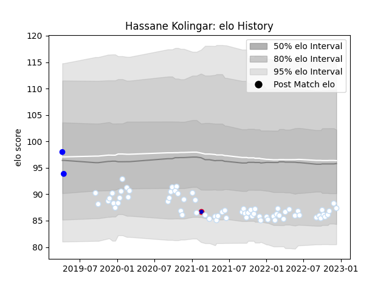

---  
layout: page  
title: Hassane Kolingar  
date: 2022-12-18 16:37:42.415574  
categories: player  
---
# Hassane Kolingar

## Positions: P

## Country: France

## Current elo: 87.0

## Current Percentile: 18.0

# Elo History

# Match History

| Team      |   Appearances |   Win Rate |
|:----------|--------------:|-----------:|
| Racing 92 |            69 |   0.572464 |
| Vannes    |             2 |   1        |
| France    |             1 |   1        |

| Opponent             |   Matches |   Win Rate |
|:---------------------|----------:|-----------:|
| Clermont Auvergne    |         7 |   0.857143 |
| La Rochelle          |         6 |   0.333333 |
| Lyon                 |         6 |   0.5      |
| Toulon               |         5 |   0.4      |
| Stade Toulousain     |         5 |   0.4      |
| Bordeaux Begles      |         5 |   0.2      |
| Stade Francais Paris |         5 |   0.8      |
| Brive                |         4 |   0.75     |
| Castres Olympique    |         4 |   0.75     |
| Montpellier Herault  |         4 |   0.5      |
| Saracens             |         3 |   0.666667 |
| Pau                  |         3 |   1        |
| Ospreys              |         2 |   1        |
| Biarritz Olympique   |         2 |   0.5      |
| Perpignan            |         2 |   0.5      |
| Munster              |         2 |   0.75     |
| Agen                 |         1 |   1        |
| Montauban            |         1 |   1        |
| Aurillac             |         1 |   1        |
| Ireland              |         1 |   1        |
| Exeter Chiefs        |         1 |   0        |
| Bayonne              |         1 |   0        |
| Leinster             |         1 |   0        |