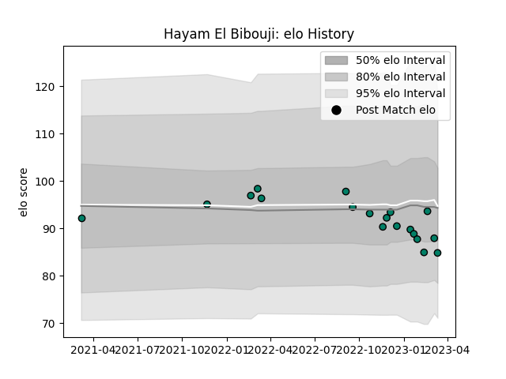

---  
layout: page  
title: Hayam El Bibouji  
date: 2023-01-15 11:57:00.677496  
categories: player  
---
# Hayam El Bibouji

## Positions: H

## Current elo: 94.0

## Current Percentile: 51.0

# Elo History

# Match History

| Team     |   Appearances |   Win Rate |
|:---------|--------------:|-----------:|
| Suresnes |            13 |   0.461538 |

| Opponent                   |   Matches |   Win Rate |
|:---------------------------|----------:|-----------:|
| Albi                       |         3 |   0.333333 |
| Rennes                     |         2 |   1        |
| Carqueiranne-Hyères        |         1 |   0        |
| Chambery                   |         1 |   1        |
| Cognac Saint Jean d'Angély |         1 |   1        |
| Narbonne                   |         1 |   0        |
| Soyaux-Angouleme           |         1 |   0        |
| Tarbes                     |         1 |   1        |
| US Bressane                |         1 |   0        |
| Valence Romans Drome Rugby |         1 |   0        |