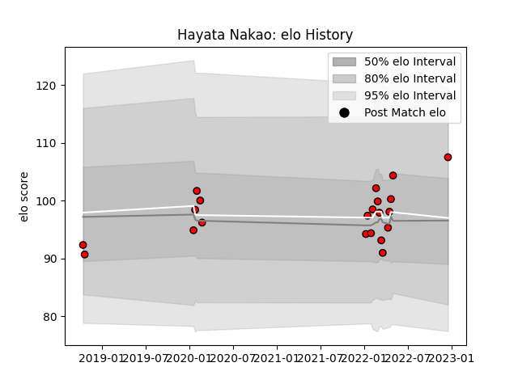

---  
layout: page  
title: Hayata Nakao  
date: 2023-01-17 11:37:27.717383  
categories: player  
---
# Hayata Nakao

## Positions: C, FH

## Current elo: 120.0

## Current Percentile: 93.0

# Elo History

# Match History

| Team                      |   Appearances |   Win Rate |
|:--------------------------|--------------:|-----------:|
| Toshiba Brave Lupus Tokyo |            29 |   0.551724 |

| Opponent                          |   Matches |   Win Rate |
|:----------------------------------|----------:|-----------:|
| Saitama Wild Knights              |         4 |   0        |
| NTT Docomo Red Hurricanes Osaka   |         3 |   1        |
| Shizuoka Blue Revs                |         3 |   0.666667 |
| Tokyo Sungoliath                  |         3 |   0.666667 |
| Black Rams Tokyo                  |         2 |   1        |
| Kobelco Kobe Steelers             |         2 |   0.5      |
| Kubota Spears Funabashi Tokyo-Bay |         2 |   0        |
| Mie Honda Heat                    |         2 |   0.5      |
| Mitsubishi Dynaboars              |         2 |   0.5      |
| Toyota Verblitz                   |         2 |   0.5      |
| Coca-Cola Red Sparks              |         1 |   1        |
| Green Rockets Tokatsu             |         1 |   1        |
| Urayasu D-Rocks                   |         1 |   0        |
| Yokohama Canon Eagles             |         1 |   1        |