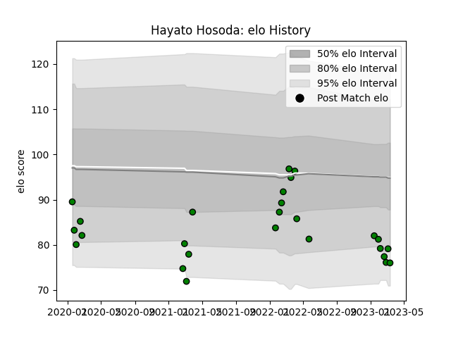

---  
layout: page  
title: Hayato Hosoda  
date: 2023-02-02 18:48:13.615412  
categories: player  
---
# Hayato Hosoda

## Positions: P

## Current elo: 81.0

## Current Percentile: 12.0

# Elo History

# Match History

| Team                 |   Appearances |   Win Rate |
|:---------------------|--------------:|-----------:|
| Mitsubishi Dynaboars |            15 |        0.6 |

| Opponent                  |   Matches |   Win Rate |
|:--------------------------|----------:|-----------:|
| Hino Red Dolphins         |         2 |        1   |
| Mie Honda Heat            |         2 |        0.5 |
| Skyactivs Hiroshima       |         2 |        1   |
| Toshiba Brave Lupus Tokyo |         2 |        0.5 |
| Green Rockets Tokatsu     |         1 |        1   |
| Hanazono Kintetsu Liners  |         1 |        1   |
| Kamaishi Seawaves         |         1 |        1   |
| Saitama Wild Knights      |         1 |        0   |
| Shizuoka Blue Revs        |         1 |        0   |
| Tokyo Sungoliath          |         1 |        0   |
| Yokohama Canon Eagles     |         1 |        0   |