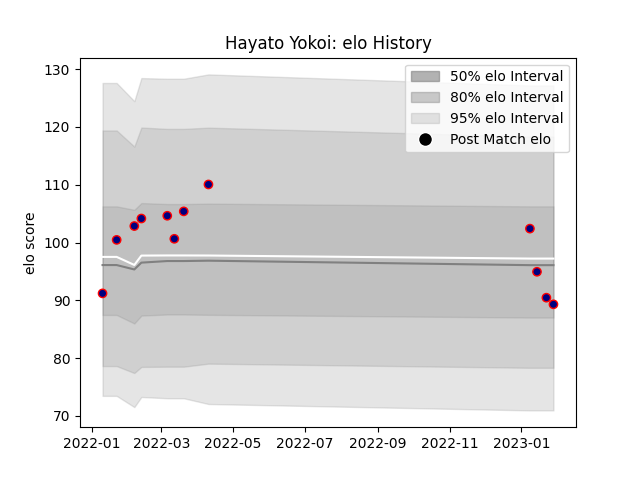

---  
layout: page  
title: Hayato Yokoi  
date: 2023-03-17 17:35:52.760371  
categories: player  
---
# Hayato Yokoi

## Positions: FL, L

## Current elo: 87.0

## Current Percentile: 34.0

# Elo History

# Match History

| Team                     |   Appearances |   Win Rate |
|:-------------------------|--------------:|-----------:|
| Hanazono Kintetsu Liners |            17 |   0.352941 |

| Opponent                          |   Matches |   Win Rate |
|:----------------------------------|----------:|-----------:|
| Mitsubishi Dynaboars              |         3 |          0 |
| Mie Honda Heat                    |         2 |          1 |
| Skyactivs Hiroshima               |         2 |          1 |
| Black Rams Tokyo                  |         1 |          0 |
| Hino Red Dolphins                 |         1 |          1 |
| Kamaishi Seawaves                 |         1 |          1 |
| Kubota Spears Funabashi Tokyo-Bay |         1 |          0 |
| Saitama Wild Knights              |         1 |          0 |
| Shizuoka Blue Revs                |         1 |          0 |
| Tokyo Sungoliath                  |         1 |          0 |
| Toshiba Brave Lupus Tokyo         |         1 |          0 |
| Toyota Verblitz                   |         1 |          0 |
| Yokohama Canon Eagles             |         1 |          0 |