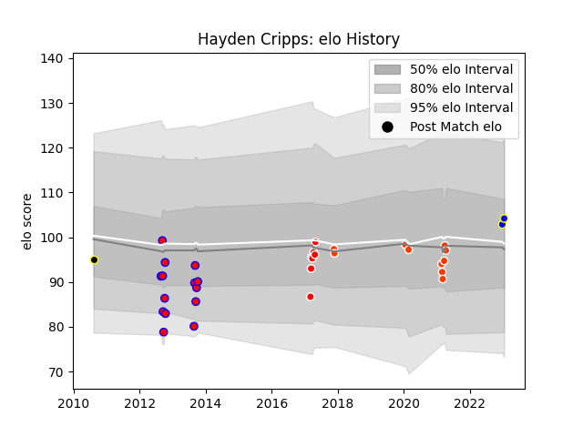

---  
layout: page  
title: Hayden Cripps  
date: 2023-01-17 11:29:27.341532  
categories: player  
---
# Hayden Cripps

## Positions: FH

## Current elo: 104.0

## Current Percentile: 64.0

# Elo History

# Match History

| Team              |   Appearances |   Win Rate |
|:------------------|--------------:|-----------:|
| Tasman            |            14 |   0.642857 |
| Hino Red Dolphins |            10 |   0.3      |
| Sunwolves         |             7 |   0.142857 |
| Urayasu D-Rocks   |             2 |   1        |
| Wellington        |             1 |   0        |

| Opponent                         |   Matches |   Win Rate |
|:---------------------------------|----------:|-----------:|
| Counties Manukau                 |         3 |   0.666667 |
| Bulls                            |         2 |   0.5      |
| Canterbury                       |         2 |   0.5      |
| Green Rockets Tokatsu            |         2 |   1        |
| Otago                            |         2 |   0.5      |
| North Harbour                    |         2 |   0        |
| Bay of Plenty                    |         1 |   1        |
| Northland                        |         1 |   0        |
| Tokyo Sungoliath                 |         1 |   0        |
| Taranaki                         |         1 |   1        |
| Stormers                         |         1 |   0        |
| Southland                        |         1 |   1        |
| Southern Kings                   |         1 |   0        |
| Shizuoka Blue Revs               |         1 |   0        |
| Shimizu Blue Sharks              |         1 |   1        |
| Saitama Wild Knights             |         1 |   0        |
| Mie Honda Heat                   |         1 |   0        |
| NTT Docomo Red Hurricanes Osaka  |         1 |   0        |
| Black Rams Tokyo                 |         1 |   0        |
| Manawatu                         |         1 |   1        |
| Kyuden Voltex                    |         1 |   1        |
| Kobelco Kobe Steelers            |         1 |   0        |
| Highlanders                      |         1 |   0        |
| Hawke's Bay                      |         1 |   1        |
| Chiefs                           |         1 |   0        |
| Cheetahs                         |         1 |   0        |
| Toyota Industries Shuttles Aichi |         1 |   1        |