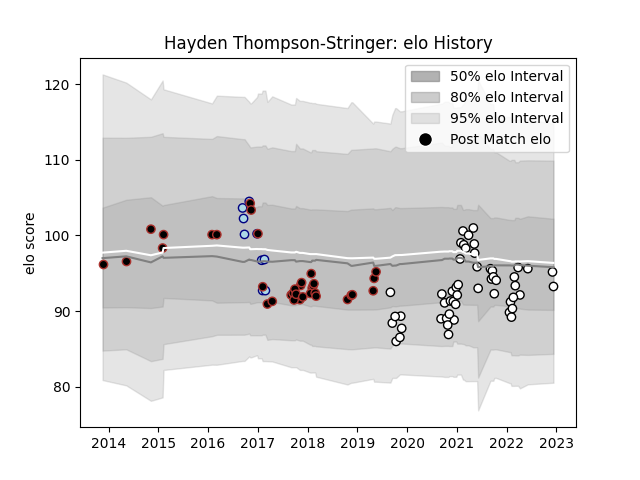

---  
layout: page  
title: Hayden Thompson-Stringer  
date: 2022-12-18 16:39:37.790950  
categories: player  
---
# Hayden Thompson-Stringer

## Positions: P

## Current elo: 93.0

## Current Percentile: 48.0

# Elo History

# Match History

| Team     |   Appearances |   Win Rate |
|:---------|--------------:|-----------:|
| Brive    |            51 |   0.421569 |
| Saracens |            35 |   0.657143 |
| Bedford  |             9 |   0.222222 |

| Opponent             |   Matches |   Win Rate |
|:---------------------|----------:|-----------:|
| Leicester Tigers     |         7 |   0.428571 |
| La Rochelle          |         5 |   0.2      |
| Exeter Chiefs        |         5 |   0.4      |
| Stade Francais Paris |         5 |   0.6      |
| Castres Olympique    |         4 |   0.5      |
| Montpellier Herault  |         4 |   0.375    |
| Northampton Saints   |         4 |   0.75     |
| Sale Sharks          |         4 |   0.75     |
| Bordeaux Begles      |         4 |   0.25     |
| Clermont Auvergne    |         3 |   0.333333 |
| Stade Toulousain     |         3 |   0.333333 |
| Racing 92            |         3 |   0        |
| Pau                  |         3 |   1        |
| Toulon               |         3 |   0.666667 |
| Newcastle Falcons    |         3 |   1        |
| Lyon                 |         3 |   0.666667 |
| Agen                 |         3 |   0.666667 |
| Wasps                |         2 |   1        |
| Worcester Warriors   |         2 |   0.5      |
| Doncaster            |         2 |   0        |
| Jersey               |         2 |   0.5      |
| Bayonne              |         2 |   0.5      |
| Gloucester Rugby     |         2 |   0        |
| Ealing Trailfinders  |         2 |   0        |
| Bath Rugby           |         1 |   1        |
| Biarritz Olympique   |         1 |   1        |
| Bristol Rugby        |         1 |   0        |
| Cardiff Blues        |         1 |   0        |
| Scarlets             |         1 |   1        |
| Saracens             |         1 |   0        |
| Richmond             |         1 |   0        |
| Rotherham Titans     |         1 |   1        |
| London Welsh         |         1 |   1        |
| Dragons              |         1 |   1        |
| Perpignan            |         1 |   1        |
| Ospreys              |         1 |   1        |
| Edinburgh            |         1 |   0        |
| Harlequins           |         1 |   0        |
| London Irish         |         1 |   0        |