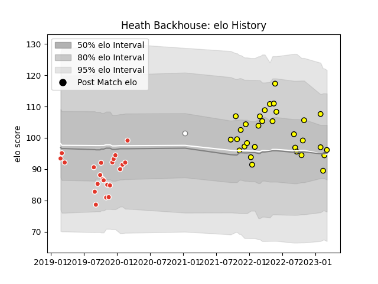

---  
layout: page  
title: Heath Backhouse  
date: 2023-02-16 11:19:35.512106  
categories: player  
---
# Heath Backhouse

## Positions: L

## Current elo: 90.0

## Current Percentile: 61.0

# Elo History

# Match History

| Team               |   Appearances |   Win Rate |
|:-------------------|--------------:|-----------:|
| Albi               |            29 |   0.672414 |
| Biarritz Olympique |            22 |   0.522727 |
| Pumas              |             1 |   1        |

| Opponent                   |   Matches |   Win Rate |
|:---------------------------|----------:|-----------:|
| Vannes                     |         3 |   0.666667 |
| Massy                      |         3 |   0.333333 |
| Blagnac                    |         3 |   0.666667 |
| Bourgoin-Jallieu           |         3 |   1        |
| Chambery                   |         3 |   1        |
| Soyaux-Angouleme           |         3 |   0.333333 |
| Valence Romans Drome Rugby |         2 |   0.5      |
| Tarbes                     |         2 |   0.5      |
| Suresnes                   |         2 |   0.5      |
| Provence Rugby             |         2 |   0.5      |
| Nice                       |         2 |   0.25     |
| Narbonne                   |         2 |   1        |
| Montauban                  |         2 |   0.5      |
| Grenoble                   |         2 |   0.75     |
| Carcassonne                |         2 |   0        |
| Dax                        |         2 |   1        |
| Rennes                     |         1 |   1        |
| Blue Bulls                 |         1 |   1        |
| Carqueiranne-Hyères        |         1 |   0        |
| Cognac Saint Jean d'Angély |         1 |   1        |
| Roval Drome XV             |         1 |   1        |
| Rouen                      |         1 |   1        |
| Colomiers                  |         1 |   0        |
| Mont-de-Marsan             |         1 |   1        |
| Perpignan                  |         1 |   0        |
| Oyonnax                    |         1 |   1        |
| Nevers                     |         1 |   0        |
| Dijon                      |         1 |   1        |
| Beziers                    |         1 |   1        |
| Aurillac                   |         1 |   0        |