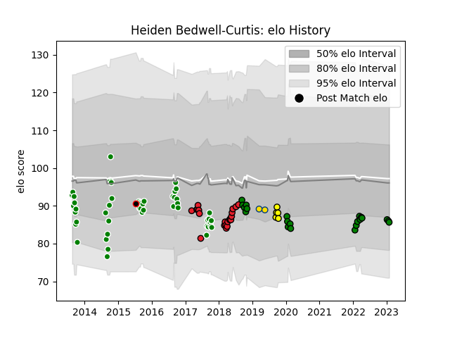

---  
layout: page  
title: Heiden Bedwell-Curtis  
date: 2023-01-13 11:32:06.589576  
categories: player  
---
# Heiden Bedwell-Curtis

## Positions: FL, N8

## Country: Crusaders

## Current elo: 86.0

## Current Percentile: 24.0

# Elo History

# Match History

| Team                 |   Appearances |   Win Rate |
|:---------------------|--------------:|-----------:|
| Manawatu             |            49 |   0.469388 |
| Crusaders            |            21 |   0.857143 |
| Mitsubishi Dynaboars |            19 |   0.578947 |
| Taranaki             |             5 |   0.2      |
| Hurricanes           |             2 |   0.25     |
| New Zealand Maori    |             1 |   1        |

| Opponent                        |   Matches |   Win Rate |
|:--------------------------------|----------:|-----------:|
| Southland                       |         7 |   0.857143 |
| Hawke's Bay                     |         6 |   0.333333 |
| Northland                       |         5 |   1        |
| Waikato                         |         5 |   0.4      |
| Bay of Plenty                   |         4 |   0.25     |
| Otago                           |         4 |   0.25     |
| Taranaki                        |         4 |   0.25     |
| North Harbour                   |         4 |   0.5      |
| Hurricanes                      |         3 |   0.666667 |
| Highlanders                     |         3 |   0.666667 |
| Auckland                        |         3 |   0        |
| Chiefs                          |         3 |   0.833333 |
| Canterbury                      |         3 |   0.333333 |
| Tasman                          |         3 |   0.333333 |
| Wellington                      |         3 |   0.333333 |
| Counties Manukau                |         3 |   0.333333 |
| NTT Docomo Red Hurricanes Osaka |         2 |   0        |
| Skyactivs Hiroshima             |         2 |   1        |
| Saitama Wild Knights            |         2 |   0        |
| Melbourne Rebels                |         2 |   1        |
| Lions                           |         2 |   1        |
| Hanazono Kintetsu Liners        |         2 |   0.5      |
| Kamaishi Seawaves               |         2 |   1        |
| Jaguares                        |         2 |   0.5      |
| Hino Red Dolphins               |         2 |   1        |
| Bulls                           |         2 |   1        |
| Green Rockets Tokatsu           |         1 |   1        |
| Blues                           |         1 |   1        |
| British and Irish Lions         |         1 |   0        |
| Brumbies                        |         1 |   1        |
| Stormers                        |         1 |   1        |
| Fiji                            |         1 |   1        |
| Mazda Blue Zoomers              |         1 |   1        |
| Shizuoka Blue Revs              |         1 |   0        |
| Kyuden Voltex                   |         1 |   1        |
| Queensland Reds                 |         1 |   1        |
| New South Wales Waratahs        |         1 |   1        |
| Kurita Water Gush               |         1 |   1        |
| Mie Honda Heat                  |         1 |   0        |
| Yokohama Canon Eagles           |         1 |   0        |