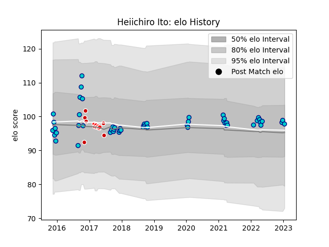

---  
layout: page  
title: Heiichiro Ito  
date: 2023-03-17 17:09:28.824422  
categories: player  
---
# Heiichiro Ito

## Positions: P

## Country: Japan

## Current elo: 95.0

## Current Percentile: 50.0

# Elo History

# Match History

| Team               |   Appearances |   Win Rate |
|:-------------------|--------------:|-----------:|
| Shizuoka Blue Revs |            61 |   0.688525 |
| Sunwolves          |             8 |   0.125    |
| Japan              |             6 |   0.333333 |

| Opponent                          |   Matches |   Win Rate |
|:----------------------------------|----------:|-----------:|
| Toyota Verblitz                   |         7 |   0.714286 |
| Black Rams Tokyo                  |         6 |   0.833333 |
| Yokohama Canon Eagles             |         5 |   0.8      |
| Kobelco Kobe Steelers             |         5 |   0.2      |
| Saitama Wild Knights              |         5 |   0.2      |
| Urayasu D-Rocks                   |         4 |   1        |
| Toshiba Brave Lupus Tokyo         |         4 |   0.5      |
| Tokyo Sungoliath                  |         4 |   0        |
| Kubota Spears Funabashi Tokyo-Bay |         4 |   0.75     |
| Green Rockets Tokatsu             |         3 |   1        |
| NTT Docomo Red Hurricanes Osaka   |         3 |   1        |
| Coca-Cola Red Sparks              |         3 |   1        |
| Bulls                             |         2 |   0.5      |
| Mie Honda Heat                    |         2 |   1        |
| Munakata Sanix Blues              |         2 |   1        |
| Toyota Industries Shuttles Aichi  |         2 |   1        |
| Hino Red Dolphins                 |         2 |   1        |
| Highlanders                       |         1 |   0        |
| Crusaders                         |         1 |   0        |
| Wales                             |         1 |   0        |
| Chiefs                            |         1 |   0        |
| Fiji                              |         1 |   0        |
| Stormers                          |         1 |   0        |
| Southern Kings                    |         1 |   0        |
| Romania                           |         1 |   1        |
| Georgia                           |         1 |   1        |
| Ireland                           |         1 |   0        |
| Hurricanes                        |         1 |   0        |
| Argentina                         |         1 |   0        |