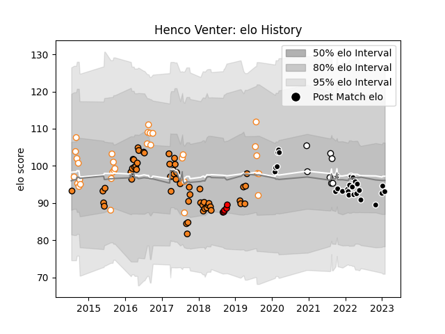

---  
layout: page  
title: Henco Venter  
date: 2023-01-06 00:15:52.102521  
categories: player  
---
# Henco Venter

## Positions: FL, N8

## Current elo: 118.0

## Current Percentile: 85.0

# Elo History

# Match History

| Team                      |   Appearances |   Win Rate |
|:--------------------------|--------------:|-----------:|
| Cheetahs                  |            53 |   0.339623 |
| Free State Cheetahs       |            32 |   0.578125 |
| Sharks                    |            25 |   0.7      |
| Natal Sharks              |             7 |   0.571429 |
| Toshiba Brave Lupus Tokyo |             5 |   0.2      |

| Opponent                          |   Matches |   Win Rate |
|:----------------------------------|----------:|-----------:|
| Bulls                             |         9 |   0.555556 |
| Stormers                          |         7 |   0.214286 |
| Blue Bulls                        |         7 |   0.571429 |
| Griquas                           |         7 |   0.714286 |
| Western Province                  |         7 |   0.571429 |
| Natal Sharks                      |         5 |   0.5      |
| Southern Kings                    |         5 |   1        |
| Lions                             |         5 |   0.4      |
| Sunwolves                         |         4 |   1        |
| Ospreys                           |         4 |   0.5      |
| Golden Lions                      |         4 |   0.25     |
| Pumas                             |         4 |   0.5      |
| Connacht                          |         3 |   0.666667 |
| Eastern Province Kings            |         3 |   0.666667 |
| Cardiff Blues                     |         3 |   0.333333 |
| Scarlets                          |         3 |   0.333333 |
| Munster                           |         3 |   0        |
| Jaguares                          |         3 |   0.333333 |
| Glasgow Warriors                  |         3 |   0        |
| New South Wales Waratahs          |         2 |   0        |
| Leinster                          |         2 |   1        |
| Melbourne Rebels                  |         2 |   0.5      |
| Zebre                             |         2 |   1        |
| Sharks                            |         2 |   0        |
| Highlanders                       |         2 |   0.5      |
| Dragons                           |         2 |   1        |
| Ulster                            |         2 |   0        |
| Queensland Reds                   |         2 |   0.5      |
| Shizuoka Blue Revs                |         1 |   0        |
| Western Force                     |         1 |   1        |
| Yokohama Canon Eagles             |         1 |   0        |
| Benetton Treviso                  |         1 |   1        |
| Saitama Wild Knights              |         1 |   0        |
| Black Rams Tokyo                  |         1 |   1        |
| Hurricanes                        |         1 |   0        |
| Free State Cheetahs               |         1 |   1        |
| Edinburgh                         |         1 |   0        |
| Crusaders                         |         1 |   0        |
| Chiefs                            |         1 |   0        |
| Brumbies                          |         1 |   0        |
| Boland Cavaliers                  |         1 |   1        |
| Blues                             |         1 |   0        |
| Kubota Spears Funabashi Tokyo-Bay |         1 |   0        |