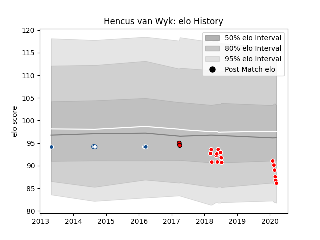

---  
layout: page  
title: Hencus van Wyk  
date: 2023-01-17 11:41:11.690419  
categories: player  
---
# Hencus van Wyk

## Positions: P

## Current elo: 88.0

## Current Percentile: 24.0

# Elo History

# Match History

| Team       |   Appearances |   Win Rate |
|:-----------|--------------:|-----------:|
| Sunwolves  |            16 |   0.25     |
| Bulls      |             3 |   0.833333 |
| Blue Bulls |             2 |   0        |
| Lions      |             2 |   1        |

| Opponent                 |   Matches |   Win Rate |
|:-------------------------|----------:|-----------:|
| Melbourne Rebels         |         3 |   0.666667 |
| Queensland Reds          |         3 |   0.333333 |
| Sharks                   |         3 |   0.5      |
| Brumbies                 |         2 |   0        |
| Chiefs                   |         2 |   0        |
| New South Wales Waratahs |         2 |   0.5      |
| Western Province         |         2 |   0        |
| Bulls                    |         1 |   1        |
| Crusaders                |         1 |   0        |
| Hurricanes               |         1 |   0        |
| Lions                    |         1 |   0        |
| Southern Kings           |         1 |   1        |
| Stormers                 |         1 |   1        |