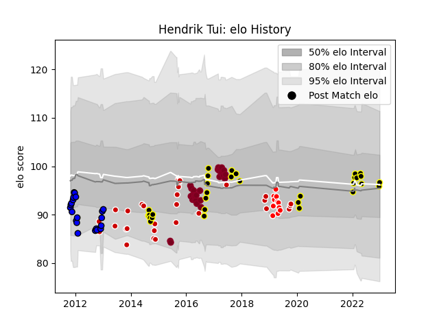

---  
layout: page  
title: Hendrik Tui  
date: 2023-01-13 11:31:34.679249  
categories: player  
---
# Hendrik Tui

## Positions: FL, N8

## Country: Japan

## Current elo: 92.0

## Current Percentile: 37.0

# Elo History

# Match History

| Team                 |   Appearances |   Win Rate |
|:---------------------|--------------:|-----------:|
| Tokyo Sungoliath     |            32 |   0.84375  |
| Japan                |            31 |   0.612903 |
| Queensland Reds      |            30 |   0.216667 |
| Saitama Wild Knights |            21 |   0.857143 |
| Sunwolves            |            11 |   0.181818 |

| Opponent                          |   Matches |   Win Rate |
|:----------------------------------|----------:|-----------:|
| New South Wales Waratahs          |         6 |   0.166667 |
| Green Rockets Tokatsu             |         6 |   1        |
| Toyota Verblitz                   |         5 |   1        |
| Scotland                          |         5 |   0.2      |
| Melbourne Rebels                  |         5 |   0.2      |
| Black Rams Tokyo                  |         5 |   1        |
| Yokohama Canon Eagles             |         5 |   1        |
| NTT Docomo Red Hurricanes Osaka   |         4 |   1        |
| Chiefs                            |         4 |   0.25     |
| Toshiba Brave Lupus Tokyo         |         4 |   0.25     |
| Kobelco Kobe Steelers             |         3 |   0.666667 |
| Blues                             |         3 |   0.166667 |
| Russia                            |         3 |   1        |
| Saitama Wild Knights              |         3 |   0.333333 |
| Samoa                             |         3 |   1        |
| Shizuoka Blue Revs                |         3 |   1        |
| Brumbies                          |         3 |   0        |
| Hurricanes                        |         3 |   0        |
| Hanazono Kintetsu Liners          |         3 |   1        |
| Georgia                           |         3 |   0.666667 |
| Western Force                     |         3 |   0        |
| Romania                           |         3 |   1        |
| Crusaders                         |         2 |   0        |
| Urayasu D-Rocks                   |         2 |   1        |
| Uruguay                           |         2 |   1        |
| Sharks                            |         2 |   0.5      |
| Wales                             |         2 |   0.5      |
| Coca-Cola Red Sparks              |         2 |   1        |
| New Zealand Maori                 |         2 |   0        |
| Munakata Sanix Blues              |         2 |   1        |
| Mie Honda Heat                    |         2 |   1        |
| Highlanders                       |         2 |   0.5      |
| New Zealand                       |         2 |   0        |
| Tokyo Sungoliath                  |         1 |   0        |
| England                           |         1 |   0        |
| Ireland                           |         1 |   0        |
| Italy                             |         1 |   1        |
| United States of America          |         1 |   1        |
| Jaguares                          |         1 |   0        |
| Toyota Industries Shuttles Aichi  |         1 |   1        |
| Kubota Spears Funabashi Tokyo-Bay |         1 |   0        |
| Stormers                          |         1 |   0        |
| Sunwolves                         |         1 |   1        |
| Spain                             |         1 |   1        |
| Southern Kings                    |         1 |   1        |
| South Africa                      |         1 |   1        |
| Kyuden Voltex                     |         1 |   1        |
| Lions                             |         1 |   0        |
| Bulls                             |         1 |   0        |
| Cheetahs                          |         1 |   1        |
| Queensland Reds                   |         1 |   0        |