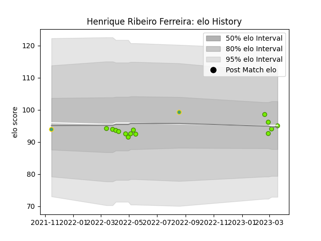

---  
layout: page  
title: Henrique Ribeiro Ferreira  
date: 2023-03-04 11:42:02.728711  
categories: player  
---
# Henrique Ribeiro Ferreira

## Positions: P

## Country: Brazil

## Current elo: 93.0

## Current Percentile: 62.0

# Elo History

# Match History

| Team   |   Appearances |   Win Rate |
|:-------|--------------:|-----------:|
| Cobras |            12 |  0.0833333 |
| Brazil |             2 |  0         |

| Opponent      |   Matches |   Win Rate |
|:--------------|----------:|-----------:|
| Cafeteros Pro |         2 |        0   |
| Dogos XV      |         2 |        0   |
| Jaguares XV   |         2 |        0   |
| Olimpia Lions |         2 |        0.5 |
| Penarol Rugby |         2 |        0   |
| Chile         |         1 |        0   |
| Pampas XV     |         1 |        0   |
| Selknam       |         1 |        0   |
| Zimbabwe      |         1 |        0   |