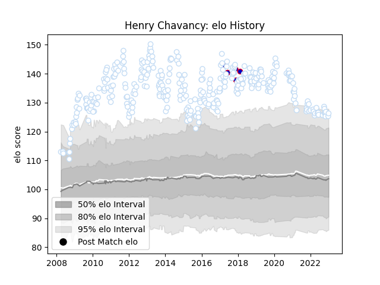

---  
layout: page  
title: Henry Chavancy  
date: 2022-12-28 12:58:01.653882  
categories: player  
---
# Henry Chavancy

## Positions: C

## Country: France

## Current elo: 119.0

## Current Percentile: 95.0

# Elo History

# Match History

| Team      |   Appearances |   Win Rate |
|:----------|--------------:|-----------:|
| Racing 92 |           346 |   0.606936 |
| France    |             5 |   0.1      |

| Opponent             |   Matches |   Win Rate |
|:---------------------|----------:|-----------:|
| Castres Olympique    |        25 |   0.58     |
| Toulon               |        23 |   0.521739 |
| Clermont Auvergne    |        23 |   0.521739 |
| Montpellier Herault  |        23 |   0.630435 |
| Stade Toulousain     |        22 |   0.5      |
| Stade Francais Paris |        20 |   0.6      |
| Bordeaux Begles      |        20 |   0.6      |
| La Rochelle          |        17 |   0.470588 |
| Bayonne              |        17 |   0.764706 |
| Brive                |        15 |   0.833333 |
| Lyon                 |        14 |   0.5      |
| Perpignan            |        13 |   0.538462 |
| Grenoble             |        13 |   0.692308 |
| Pau                  |        11 |   0.772727 |
| Biarritz Olympique   |        10 |   0.7      |
| Oyonnax              |        10 |   0.6      |
| Agen                 |         8 |   0.4375   |
| Munster              |         7 |   0.5      |
| Saracens             |         6 |   0.333333 |
| Scarlets             |         6 |   0.75     |
| Leicester Tigers     |         5 |   0.8      |
| Bourgoin-Jallieu     |         3 |   0.666667 |
| Aurillac             |         3 |   1        |
| Ospreys              |         3 |   1        |
| Northampton Saints   |         3 |   0.833333 |
| Benetton Treviso     |         2 |   1        |
| Ulster               |         2 |   0.5      |
| Narbonne             |         2 |   1        |
| Tarbes               |         2 |   1        |
| Cardiff Blues        |         2 |   0        |
| Edinburgh            |         2 |   0        |
| Mont-de-Marsan       |         2 |   0.5      |
| Albi                 |         2 |   1        |
| Glasgow Warriors     |         2 |   0.5      |
| Ireland              |         2 |   0        |
| South Africa         |         1 |   0        |
| US Bressane          |         1 |   1        |
| Limoges              |         1 |   1        |
| New Zealand          |         1 |   0        |
| Montauban            |         1 |   1        |
| Leinster             |         1 |   0        |
| Japan                |         1 |   0.5      |
| Harlequins           |         1 |   0        |
| Exeter Chiefs        |         1 |   0        |
| Beziers              |         1 |   1        |
| Wasps                |         1 |   1        |