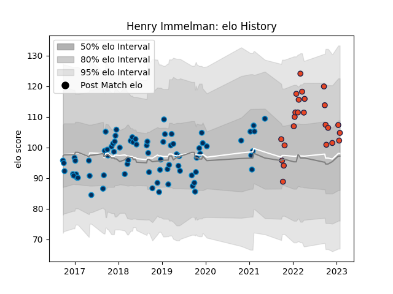

---  
layout: page  
title: Henry Immelman  
date: 2023-02-02 19:07:41.533260  
categories: player  
---
# Henry Immelman

## Positions: FB, W

## Current elo: 105.0

## Current Percentile: 62.0

# Elo History

# Match History

| Team                |   Appearances |   Win Rate |
|:--------------------|--------------:|-----------:|
| Montpellier Herault |            76 |   0.506579 |
| Edinburgh           |            24 |   0.479167 |

| Opponent             |   Matches |   Win Rate |
|:---------------------|----------:|-----------:|
| Castres Olympique    |        11 |   0.454545 |
| Toulon               |         9 |   0.611111 |
| Bordeaux Begles      |         6 |   0.666667 |
| Lyon                 |         6 |   0.333333 |
| La Rochelle          |         5 |   0.4      |
| Brive                |         5 |   0.8      |
| Stade Toulousain     |         5 |   0.4      |
| Agen                 |         4 |   0.75     |
| Stade Francais Paris |         4 |   0.75     |
| Pau                  |         4 |   0.75     |
| Clermont Auvergne    |         3 |   0.666667 |
| Racing 92            |         3 |   0        |
| Glasgow Warriors     |         3 |   0.666667 |
| Stormers             |         2 |   0.25     |
| Leinster             |         2 |   0        |
| Lions                |         2 |   0        |
| Edinburgh            |         2 |   0.5      |
| Connacht             |         2 |   0.5      |
| Benetton Treviso     |         2 |   0        |
| Bulls                |         2 |   0.5      |
| Zebre                |         2 |   1        |
| Munster              |         1 |   0        |
| Newcastle Falcons    |         1 |   1        |
| Northampton Saints   |         1 |   1        |
| Ospreys              |         1 |   0        |
| Oyonnax              |         1 |   1        |
| Gloucester Rugby     |         1 |   0        |
| Perpignan            |         1 |   0        |
| Dragons              |         1 |   1        |
| Saracens             |         1 |   1        |
| Scarlets             |         1 |   1        |
| Sharks               |         1 |   0        |
| Exeter Chiefs        |         1 |   0        |
| Cardiff Blues        |         1 |   1        |
| London Irish         |         1 |   0        |
| Bayonne              |         1 |   0        |
| Grenoble             |         1 |   0        |