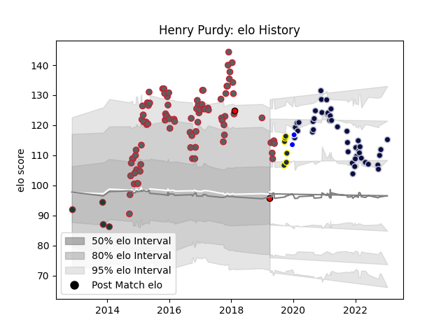

---  
layout: page  
title: Henry Purdy  
date: 2023-01-15 11:51:41.133491  
categories: player  
---
# Henry Purdy

## Positions: W, C

## Current elo: 96.0

## Current Percentile: None

# Elo History

# Match History

| Team             |   Appearances |   Win Rate |
|:-----------------|--------------:|-----------:|
| Gloucester Rugby |            86 |   0.569767 |
| Bristol Rugby    |            43 |   0.593023 |
| Otago            |             6 |   0.333333 |
| Leicester Tigers |             4 |   0.5      |
| Coventry         |             2 |   0.5      |
| Hartpury College |             2 |   1        |

| Opponent             |   Matches |   Win Rate |
|:---------------------|----------:|-----------:|
| Worcester Warriors   |        11 |   0.772727 |
| Newcastle Falcons    |        11 |   0.545455 |
| Harlequins           |        11 |   0.318182 |
| Wasps                |        10 |   0.4      |
| Northampton Saints   |        10 |   0.45     |
| Bath Rugby           |         8 |   0.5625   |
| Sale Sharks          |         8 |   0.375    |
| Leicester Tigers     |         8 |   0.25     |
| London Irish         |         7 |   0.857143 |
| Exeter Chiefs        |         7 |   0.285714 |
| Saracens             |         7 |   0.428571 |
| Zebre                |         7 |   0.928571 |
| Gloucester Rugby     |         5 |   0.6      |
| Ospreys              |         3 |   1        |
| La Rochelle          |         3 |   0.666667 |
| Nottingham           |         2 |   1        |
| London Welsh         |         2 |   1        |
| Pau                  |         2 |   0        |
| Agen                 |         2 |   1        |
| Dragons              |         2 |   1        |
| Ampthill             |         1 |   0        |
| Bristol Rugby        |         1 |   1        |
| Bayonne              |         1 |   1        |
| Wellington           |         1 |   0        |
| Bedford              |         1 |   1        |
| Waikato              |         1 |   1        |
| Stade Francais Paris |         1 |   1        |
| Scarlets             |         1 |   1        |
| Brive                |         1 |   1        |
| Cardiff Blues        |         1 |   1        |
| Oyonnax              |         1 |   1        |
| Hawke's Bay          |         1 |   0        |
| Connacht             |         1 |   1        |
| Northland            |         1 |   0        |
| Canterbury           |         1 |   0        |
| North Harbour        |         1 |   1        |
| Edinburgh            |         1 |   1        |