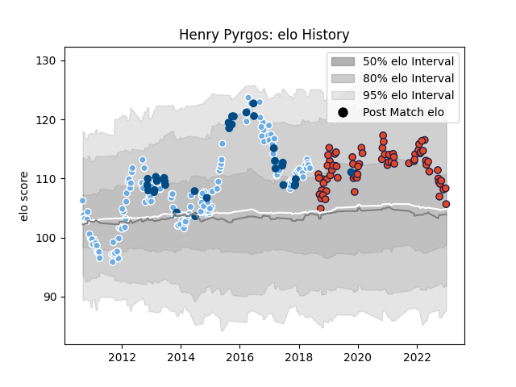

---  
layout: page  
title: Henry Pyrgos  
date: 2022-12-31 16:29:16.354861  
categories: player  
---
# Henry Pyrgos

## Positions: SH

## Country: Scotland

## Current elo: 93.0

## Current Percentile: 42.0

# Elo History

# Match History

| Team             |   Appearances |   Win Rate |
|:-----------------|--------------:|-----------:|
| Glasgow Warriors |           161 |   0.596273 |
| Edinburgh        |            72 |   0.5625   |
| Scotland         |            35 |   0.571429 |

| Opponent                 |   Matches |   Win Rate |
|:-------------------------|----------:|-----------:|
| Dragons                  |        20 |   0.675    |
| Leinster                 |        19 |   0.421053 |
| Ulster                   |        19 |   0.263158 |
| Connacht                 |        17 |   0.735294 |
| Benetton Treviso         |        17 |   0.764706 |
| Munster                  |        17 |   0.352941 |
| Cardiff Blues            |        17 |   0.823529 |
| Scarlets                 |        15 |   0.533333 |
| Edinburgh                |        12 |   0.625    |
| Glasgow Warriors         |        11 |   0.454545 |
| Ospreys                  |        10 |   0.6      |
| Zebre                    |         9 |   0.888889 |
| Italy                    |         6 |   1        |
| Montpellier Herault      |         6 |   0.75     |
| Toulon                   |         4 |   0.5      |
| Stade Toulousain         |         4 |   0        |
| Bath Rugby               |         4 |   0.5      |
| Aironi                   |         4 |   1        |
| Japan                    |         4 |   1        |
| Samoa                    |         3 |   0.666667 |
| South Africa             |         3 |   0        |
| Cheetahs                 |         3 |   1        |
| Ireland                  |         3 |   0.333333 |
| Wasps                    |         3 |   0.666667 |
| Australia                |         3 |   0.666667 |
| Leicester Tigers         |         2 |   1        |
| Argentina                |         2 |   1        |
| Wales                    |         2 |   0.5      |
| New Zealand              |         2 |   0        |
| Newcastle Falcons        |         2 |   1        |
| Stormers                 |         2 |   0        |
| Exeter Chiefs            |         2 |   0.5      |
| England                  |         2 |   0        |
| Racing 92                |         2 |   1        |
| Southern Kings           |         2 |   0.5      |
| Saracens                 |         2 |   0.5      |
| United States of America |         1 |   1        |
| Tonga                    |         1 |   0        |
| Northampton Saints       |         1 |   0        |
| Russia                   |         1 |   1        |
| Pau                      |         1 |   1        |
| Castres Olympique        |         1 |   0        |
| Bordeaux Begles          |         1 |   0.5      |
| Lions                    |         1 |   0        |
| Brive                    |         1 |   1        |
| France                   |         1 |   0        |
| Fiji                     |         1 |   0        |
| Bulls                    |         1 |   0        |
| Agen                     |         1 |   1        |