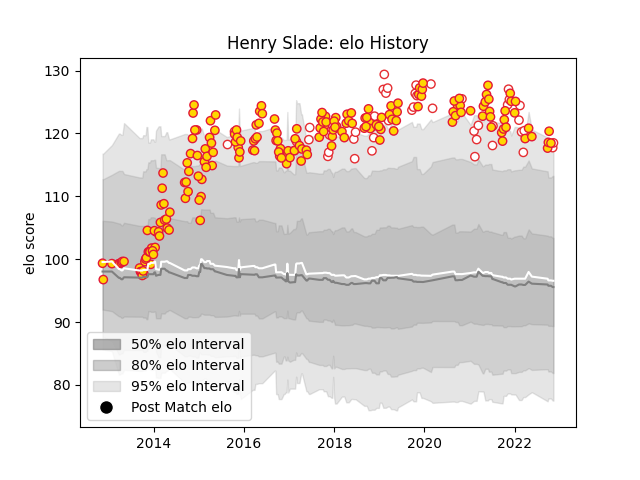

---  
layout: page  
title: Henry Slade  
date: 2022-11-16 11:23:56.339403  
categories: player  
---
# Henry Slade

## Positions: C, FH

## Country: England

## Current elo: 119.0

## Current Percentile: 93.0

# Elo History

# Match History

| Team          |   Appearances |   Win Rate |
|:--------------|--------------:|-----------:|
| Exeter Chiefs |           193 |   0.642487 |
| England       |            47 |   0.755319 |

| Opponent                 |   Matches |   Win Rate |
|:-------------------------|----------:|-----------:|
| Wasps                    |        18 |   0.694444 |
| Leicester Tigers         |        16 |   0.5      |
| Bath Rugby               |        15 |   0.533333 |
| Saracens                 |        15 |   0.366667 |
| Sale Sharks              |        15 |   0.8      |
| Northampton Saints       |        14 |   0.642857 |
| Harlequins               |        13 |   0.692308 |
| Gloucester Rugby         |        12 |   0.458333 |
| Newcastle Falcons        |        12 |   0.833333 |
| London Irish             |        10 |   0.8      |
| Bristol Rugby            |        10 |   0.7      |
| Worcester Warriors       |         9 |   1        |
| Argentina                |         6 |   0.833333 |
| South Africa             |         6 |   0.5      |
| Australia                |         5 |   1        |
| Glasgow Warriors         |         5 |   0.4      |
| Italy                    |         5 |   1        |
| Wales                    |         4 |   0.5      |
| France                   |         4 |   0.75     |
| Ireland                  |         3 |   0.666667 |
| London Welsh             |         3 |   1        |
| Scotland                 |         3 |   0.166667 |
| Bordeaux Begles          |         3 |   0.666667 |
| La Rochelle              |         2 |   1        |
| Toulon                   |         2 |   0        |
| Tonga                    |         2 |   1        |
| Connacht                 |         2 |   1        |
| Ospreys                  |         2 |   0.5      |
| Cardiff Blues            |         2 |   1        |
| Castres Olympique        |         2 |   0.5      |
| New Zealand              |         2 |   0.5      |
| Munster                  |         2 |   0.25     |
| Montpellier Herault      |         2 |   1        |
| Japan                    |         2 |   1        |
| Leinster                 |         2 |   0        |
| Racing 92                |         1 |   1        |
| Canada                   |         1 |   1        |
| Clermont Auvergne        |         1 |   0        |
| Stade Toulousain         |         1 |   1        |
| Ulster                   |         1 |   0        |
| United States of America |         1 |   1        |
| Uruguay                  |         1 |   1        |
| Fiji                     |         1 |   1        |
| Bayonne                  |         1 |   1        |
| Samoa                    |         1 |   1        |