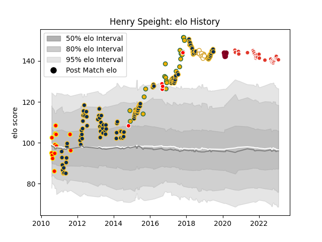

---  
layout: page  
title: Henry Speight  
date: 2023-01-06 11:42:50.291575  
categories: player  
---
# Henry Speight

## Positions: W

## Country: Australia

## Current elo: 141.0

## Current Percentile: 98.0

# Elo History

# Match History

| Team               |   Appearances |   Win Rate |
|:-------------------|--------------:|-----------:|
| Brumbies           |           121 |   0.541322 |
| Biarritz Olympique |            34 |   0.544118 |
| Australia          |            21 |   0.547619 |
| Waikato            |            13 |   0.692308 |
| Ulster             |            12 |   0.791667 |
| Queensland Reds    |             7 |   0.285714 |
| Canberra Vikings   |             5 |   0.6      |

| Opponent                 |   Matches |   Win Rate |
|:-------------------------|----------:|-----------:|
| New South Wales Waratahs |        15 |   0.533333 |
| Melbourne Rebels         |        14 |   0.5      |
| Queensland Reds          |        13 |   0.423077 |
| Western Force            |        11 |   0.863636 |
| Hurricanes               |         8 |   0.75     |
| Bulls                    |         8 |   0.75     |
| Lions                    |         7 |   0.428571 |
| Crusaders                |         7 |   0        |
| Sharks                   |         6 |   0.5      |
| Stormers                 |         6 |   0.333333 |
| Chiefs                   |         6 |   0.333333 |
| New Zealand              |         5 |   0.2      |
| Jaguares                 |         5 |   0.2      |
| Highlanders              |         5 |   0.6      |
| Cheetahs                 |         5 |   0.7      |
| Blues                    |         5 |   0.4      |
| Sunwolves                |         5 |   1        |
| Scarlets                 |         4 |   0.75     |
| Southern Kings           |         3 |   0.833333 |
| Soyaux-Angouleme         |         3 |   1        |
| Perpignan                |         3 |   0.333333 |
| Montauban                |         3 |   0.666667 |
| Bordeaux Begles          |         2 |   0.5      |
| Manawatu                 |         2 |   0.5      |
| Brisbane City            |         2 |   0.5      |
| Wales                    |         2 |   1        |
| England                  |         2 |   0        |
| Castres Olympique        |         2 |   0        |
| Argentina                |         2 |   1        |
| Ireland                  |         2 |   0        |
| Canterbury               |         2 |   0.5      |
| Aurillac                 |         2 |   1        |
| Auckland                 |         2 |   1        |
| Scotland                 |         2 |   0.5      |
| Rouen                    |         1 |   1        |
| Racing 92                |         1 |   1        |
| Queensland Country       |         1 |   1        |
| Stade Toulousain         |         1 |   0        |
| South Africa             |         1 |   0.5      |
| Stade Francais Paris     |         1 |   1        |
| Sydney Rays              |         1 |   1        |
| Taranaki                 |         1 |   0        |
| Tasman                   |         1 |   1        |
| Toulon                   |         1 |   0        |
| United States of America |         1 |   1        |
| Uruguay                  |         1 |   1        |
| Vannes                   |         1 |   0        |
| Wellington               |         1 |   0        |
| Provence Rugby           |         1 |   1        |
| Agen                     |         1 |   0        |
| Pau                      |         1 |   0        |
| Oyonnax                  |         1 |   1        |
| Bay of Plenty            |         1 |   1        |
| Benetton Treviso         |         1 |   1        |
| Beziers                  |         1 |   0        |
| Brive                    |         1 |   1        |
| Brumbies                 |         1 |   0        |
| Carcassonne              |         1 |   1        |
| Cardiff Blues            |         1 |   1        |
| Clermont Auvergne        |         1 |   0        |
| Colomiers                |         1 |   1        |
| Connacht                 |         1 |   0        |
| Counties Manukau         |         1 |   1        |
| Dragons                  |         1 |   1        |
| Edinburgh                |         1 |   1        |
| Fiji                     |         1 |   1        |
| France                   |         1 |   1        |
| Grenoble                 |         1 |   0.5      |
| Japan                    |         1 |   1        |
| Lyon                     |         1 |   0        |
| Mont-de-Marsan           |         1 |   0        |
| Munster                  |         1 |   1        |
| NSW Country Eagles       |         1 |   0        |
| Northland                |         1 |   1        |
| Otago                    |         1 |   1        |
| Massy                    |         1 |   1        |