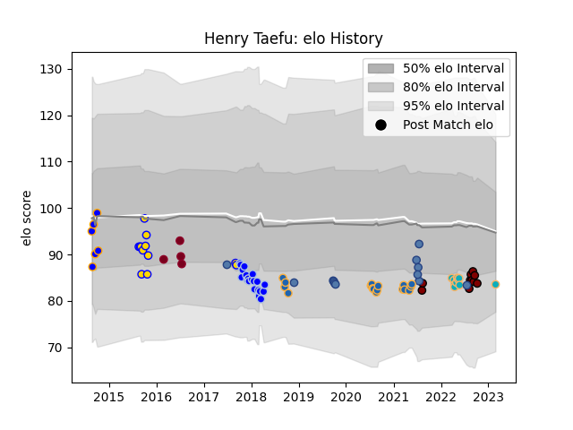

---  
layout: page  
title: Henry Taefu  
date: 2023-03-21 18:57:26.886990  
categories: player  
---
# Henry Taefu

Last updated: 2023-03-21
## Positions: C

## Country: Samoa

## Current elo: 84.0

## Current Percentile: 18.0

# Elo History

# Match History

| Team                |   Appearances |   Win Rate |
|:--------------------|--------------:|-----------:|
| Colomiers           |            20 |  0.4       |
| Western Force       |            17 |  0.117647  |
| Moana Pasifika      |            13 |  0.0769231 |
| Brisbane City       |            12 |  0.916667  |
| Samoa               |            12 |  0.5       |
| North Harbour       |            10 |  0.5       |
| Greater Sydney Rams |             6 |  0.333333  |
| Queensland Reds     |             4 |  0         |

| Opponent                 |   Matches |   Win Rate |
|:-------------------------|----------:|-----------:|
| Brumbies                 |         6 |       0    |
| Chiefs                   |         5 |       0    |
| Melbourne Rebels         |         5 |       0    |
| Queensland Reds          |         4 |       0    |
| Canberra Vikings         |         4 |       0.5  |
| Queensland Country       |         4 |       0.5  |
| Fijian Drua              |         4 |       0.25 |
| New South Wales Waratahs |         3 |       0    |
| Tonga                    |         3 |       1    |
| Montauban                |         2 |       0.5  |
| NSW Country Eagles       |         2 |       0.5  |
| Nevers                   |         2 |       0    |
| Auckland                 |         2 |       0    |
| New Zealand Maori        |         2 |       0    |
| Perth Spirit             |         2 |       1    |
| Sydney Stars             |         2 |       1    |
| Vannes                   |         2 |       0.5  |
| Mont-de-Marsan           |         2 |       0.5  |
| Melbourne Rising         |         2 |       0.5  |
| Western Force            |         2 |       0    |
| Carcassonne              |         2 |       0.5  |
| Hurricanes               |         2 |       0.5  |
| Grenoble                 |         2 |       0.5  |
| Beziers                  |         2 |       0    |
| Brisbane City            |         2 |       1    |
| Counties Manukau         |         2 |       1    |
| Wales                    |         1 |       0    |
| Waikato                  |         1 |       0    |
| Bay of Plenty            |         1 |       0    |
| Bayonne                  |         1 |       0    |
| Tasman                   |         1 |       1    |
| Spain                    |         1 |       1    |
| Soyaux-Angouleme         |         1 |       0    |
| Scotland                 |         1 |       0    |
| Russia                   |         1 |       1    |
| Ireland                  |         1 |       0    |
| Japan                    |         1 |       0    |
| North Harbour Rays       |         1 |       1    |
| Dax                      |         1 |       0    |
| Fiji                     |         1 |       1    |
| Greater Sydney Rams      |         1 |       1    |
| Narbonne                 |         1 |       1    |
| Hawke's Bay              |         1 |       0    |
| Highlanders              |         1 |       0    |
| Aurillac                 |         1 |       1    |
| Massy                    |         1 |       1    |
| Manawatu                 |         1 |       1    |
| Northland                |         1 |       1    |