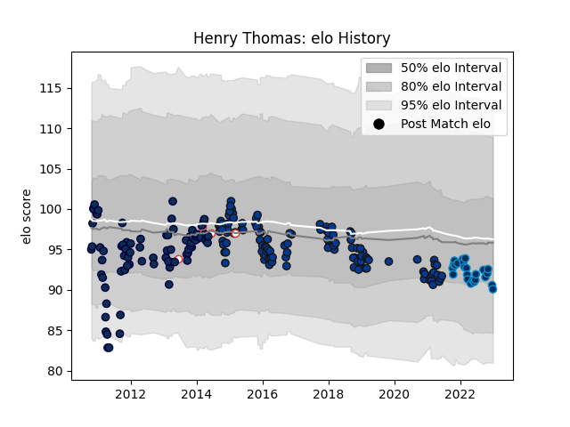

---  
layout: page  
title: Henry Thomas  
date: 2022-11-15 23:43:56.767279  
categories: player  
---
# Henry Thomas

## Positions: P

## Country: England

## Current elo: 92.0

## Current Percentile: 27.0

# Elo History

# Match History

| Team                |   Appearances |   Win Rate |
|:--------------------|--------------:|-----------:|
| Bath Rugby          |           113 |   0.50885  |
| Sale Sharks         |            82 |   0.512195 |
| Montpellier Herault |            22 |   0.704545 |
| England             |             6 |   0.666667 |

| Opponent             |   Matches |   Win Rate |
|:---------------------|----------:|-----------:|
| Wasps                |        18 |   0.527778 |
| Northampton Saints   |        17 |   0.470588 |
| Harlequins           |        17 |   0.176471 |
| Exeter Chiefs        |        16 |   0.3125   |
| Leicester Tigers     |        14 |   0.285714 |
| Worcester Warriors   |        13 |   0.846154 |
| Gloucester Rugby     |        13 |   0.807692 |
| Saracens             |        11 |   0.363636 |
| London Irish         |        11 |   0.590909 |
| Newcastle Falcons    |        11 |   0.590909 |
| Sale Sharks          |        11 |   0.681818 |
| Bath Rugby           |         7 |   0.714286 |
| Toulon               |         6 |   0.5      |
| Stade Toulousain     |         5 |   0.2      |
| Leinster             |         4 |   0.25     |
| Scarlets             |         3 |   0.333333 |
| Stade Francais Paris |         3 |   1        |
| Yorkshire Carnegie   |         3 |   1        |
| Biarritz Olympique   |         3 |   1        |
| Brive                |         3 |   0.5      |
| Agen                 |         2 |   1        |
| Castres Olympique    |         2 |   0.5      |
| Ireland              |         2 |   0.5      |
| London Welsh         |         2 |   1        |
| Lyon                 |         2 |   0.5      |
| Montpellier Herault  |         2 |   1        |
| Glasgow Warriors     |         2 |   0.5      |
| Bordeaux Begles      |         2 |   0.5      |
| Bristol Rugby        |         2 |   0        |
| Racing 92            |         2 |   1        |
| Clermont Auvergne    |         2 |   0        |
| Benetton Treviso     |         1 |   1        |
| Wales                |         1 |   1        |
| Scotland             |         1 |   1        |
| La Vila              |         1 |   1        |
| Dragons              |         1 |   0        |
| Leeds                |         1 |   1        |
| Pau                  |         1 |   1        |
| Ospreys              |         1 |   0        |
| France               |         1 |   0        |
| Italy                |         1 |   1        |
| La Rochelle          |         1 |   1        |
| Perpignan            |         1 |   1        |