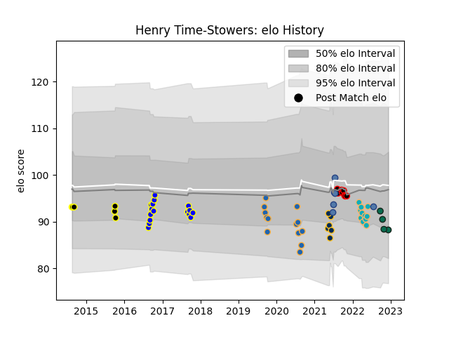

---  
layout: page  
title: Henry Time-Stowers  
date: 2022-12-18 16:30:03.936066  
categories: player  
---
# Henry Time-Stowers

## Positions: N8, FL

## Country: Samoa

## Current elo: 88.0

## Current Percentile: 23.0

# Elo History

# Match History

| Team             |   Appearances |   Win Rate |
|:-----------------|--------------:|-----------:|
| Bay of Plenty    |            16 |   0.375    |
| Western Force    |            13 |   0.384615 |
| Moana Pasifika   |            11 |   0.181818 |
| Canterbury       |             8 |   0.5      |
| Brumbies         |             6 |   0.166667 |
| Samoa            |             6 |   0.666667 |
| Wellington       |             6 |   0.25     |
| Benetton Treviso |             4 |   0        |

| Opponent                 |   Matches |   Win Rate |
|:-------------------------|----------:|-----------:|
| Manawatu                 |         4 |   0.75     |
| Otago                    |         4 |   0.25     |
| Hawke's Bay              |         3 |   0.5      |
| Tonga                    |         3 |   1        |
| Southland                |         3 |   0.666667 |
| Queensland Reds          |         3 |   0        |
| New South Wales Waratahs |         3 |   0        |
| Melbourne Rebels         |         3 |   0        |
| Hurricanes               |         3 |   0.666667 |
| Auckland                 |         3 |   0        |
| Wellington               |         3 |   0        |
| Chiefs                   |         3 |   0        |
| Brumbies                 |         3 |   0.333333 |
| Waikato                  |         2 |   0.5      |
| Blues                    |         2 |   0        |
| Taranaki                 |         2 |   0        |
| Northland                |         2 |   0.5      |
| Fijian Drua              |         2 |   0.5      |
| New Zealand Maori        |         2 |   0        |
| Bay of Plenty            |         2 |   1        |
| Crusaders                |         2 |   0        |
| Melbourne Rising         |         1 |   1        |
| NSW Country Eagles       |         1 |   0        |
| Counties Manukau         |         1 |   0        |
| North Harbour            |         1 |   0        |
| Leinster                 |         1 |   0        |
| Canberra Vikings         |         1 |   1        |
| Brisbane City            |         1 |   1        |
| Stade Francais Paris     |         1 |   0        |
| Sydney Rays              |         1 |   1        |
| Highlanders              |         1 |   0        |
| Edinburgh                |         1 |   0        |
| Glasgow Warriors         |         1 |   0        |
| Fiji                     |         1 |   1        |