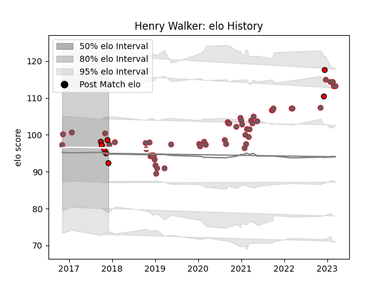

---  
layout: page  
title: Henry Walker  
date: 2023-03-21 17:58:10.680853  
categories: player  
---
# Henry Walker

Last updated: 2023-03-21
## Positions: H

## Current elo: 92.0

## Current Percentile: 62.0

# Elo History

# Match History

| Team             |   Appearances |   Win Rate |
|:-----------------|--------------:|-----------:|
| Gloucester Rugby |            53 |   0.301887 |
| Hartpury College |             8 |   0.5      |

| Opponent            |   Matches |   Win Rate |
|:--------------------|----------:|-----------:|
| Exeter Chiefs       |         7 |   0.285714 |
| Leicester Tigers    |         7 |   0.142857 |
| Sale Sharks         |         6 |   0        |
| Northampton Saints  |         5 |   0.2      |
| Wasps               |         3 |   0.666667 |
| Newcastle Falcons   |         2 |   0.5      |
| Bath Rugby          |         2 |   0        |
| Worcester Warriors  |         2 |   1        |
| Bristol Rugby       |         2 |   0        |
| Castres Olympique   |         2 |   0.5      |
| Saracens            |         2 |   0.5      |
| Munster             |         2 |   0        |
| Harlequins          |         2 |   0.5      |
| London Irish        |         2 |   0        |
| Ampthill            |         1 |   1        |
| Nottingham          |         1 |   0        |
| Stade Toulousain    |         1 |   0        |
| Ospreys             |         1 |   1        |
| Leinster            |         1 |   0        |
| Montpellier Herault |         1 |   1        |
| London Scottish     |         1 |   1        |
| La Rochelle         |         1 |   0        |
| Ealing Trailfinders |         1 |   0        |
| Doncaster           |         1 |   1        |
| Coventry            |         1 |   1        |
| Cornish Pirates     |         1 |   0        |
| Bedford             |         1 |   0        |
| Bayonne             |         1 |   1        |
| Zebre               |         1 |   1        |