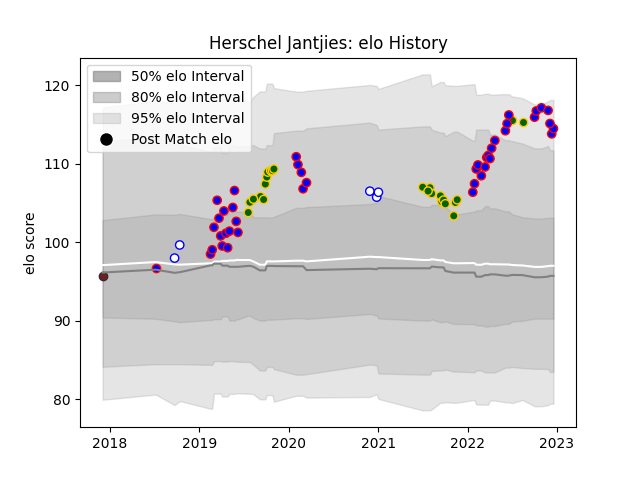

---  
layout: page  
title: Herschel Jantjies  
date: 2023-02-02 19:11:25.632319  
categories: player  
---
# Herschel Jantjies

## Positions: SH

## Country: South Africa

## Current elo: 116.0

## Current Percentile: 90.0

# Elo History

# Match History

| Team             |   Appearances |   Win Rate |
|:-----------------|--------------:|-----------:|
| Stormers         |            44 |   0.704545 |
| South Africa     |            24 |   0.6875   |
| Western Province |             9 |   0.888889 |
| Scarlets         |             1 |   0        |

| Opponent                |   Matches |   Win Rate |
|:------------------------|----------:|-----------:|
| Bulls                   |         6 |   0.833333 |
| Sharks                  |         5 |   0.7      |
| New Zealand             |         5 |   0.3      |
| Lions                   |         4 |   0.75     |
| British and Irish Lions |         3 |   0.666667 |
| Wales                   |         3 |   1        |
| Ulster                  |         3 |   0.666667 |
| Australia               |         3 |   0.333333 |
| Jaguares                |         3 |   0.666667 |
| Zebre                   |         2 |   1        |
| England                 |         2 |   0.5      |
| Hurricanes              |         2 |   0.5      |
| Pumas                   |         2 |   1        |
| Free State Cheetahs     |         2 |   1        |
| Clermont Auvergne       |         2 |   0.5      |
| Edinburgh               |         2 |   1        |
| Japan                   |         2 |   1        |
| Blues                   |         2 |   0        |
| Blue Bulls              |         2 |   0.5      |
| Griquas                 |         2 |   1        |
| Queensland Reds         |         1 |   0        |
| Ospreys                 |         1 |   1        |
| Namibia                 |         1 |   1        |
| Scarlets                |         1 |   1        |
| Scotland                |         1 |   1        |
| Sunwolves               |         1 |   1        |
| Natal Sharks            |         1 |   1        |
| Argentina               |         1 |   1        |
| Melbourne Rebels        |         1 |   1        |
| London Irish            |         1 |   1        |
| Italy                   |         1 |   1        |
| Glasgow Warriors        |         1 |   1        |
| Georgia                 |         1 |   1        |
| Dragons                 |         1 |   1        |
| Crusaders               |         1 |   0.5      |
| Connacht                |         1 |   0        |
| Cheetahs                |         1 |   0        |
| Cardiff Blues           |         1 |   1        |
| Canada                  |         1 |   1        |
| Brumbies                |         1 |   0        |
| Highlanders             |         1 |   1        |