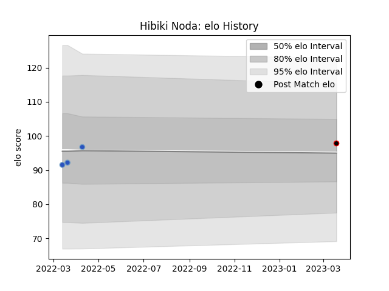

---  
layout: page  
title: Hibiki Noda  
date: 2023-03-21 18:20:46.032752  
categories: player  
---
# Hibiki Noda

Last updated: 2023-03-21
## Positions: L

## Current elo: 98.0

## Current Percentile: 53.0

# Elo History

# Match History

| Team                            |   Appearances |   Win Rate |
|:--------------------------------|--------------:|-----------:|
| Munakata Sanix Blues            |             3 |          1 |
| NTT Docomo Red Hurricanes Osaka |             1 |          1 |

| Opponent              |   Matches |   Win Rate |
|:----------------------|----------:|-----------:|
| Chugoku Red Regulions |         1 |          1 |
| Kurita Water Gush     |         1 |          1 |
| Kyuden Voltex         |         1 |          1 |
| Skyactivs Hiroshima   |         1 |          1 |