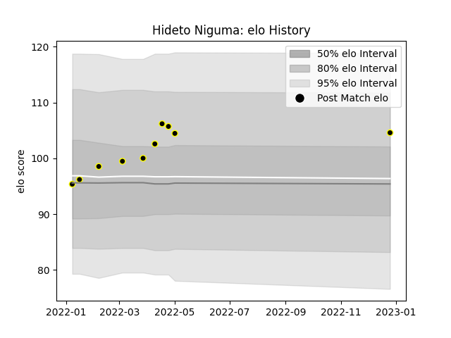

---  
layout: page  
title: Hideto Niguma  
date: 2023-03-21 18:15:33.986307  
categories: player  
---
# Hideto Niguma

Last updated: 2023-03-21
## Positions: W

## Current elo: 114.0

## Current Percentile: 84.0

# Elo History

# Match History

| Team             |   Appearances |   Win Rate |
|:-----------------|--------------:|-----------:|
| Tokyo Sungoliath |            11 |   0.909091 |

| Opponent                        |   Matches |   Win Rate |
|:--------------------------------|----------:|-----------:|
| NTT Docomo Red Hurricanes Osaka |         2 |        1   |
| Toshiba Brave Lupus Tokyo       |         2 |        0.5 |
| Black Rams Tokyo                |         1 |        1   |
| Green Rockets Tokatsu           |         1 |        1   |
| Hanazono Kintetsu Liners        |         1 |        1   |
| Kobelco Kobe Steelers           |         1 |        1   |
| Shizuoka Blue Revs              |         1 |        1   |
| Toyota Verblitz                 |         1 |        1   |
| Yokohama Canon Eagles           |         1 |        1   |