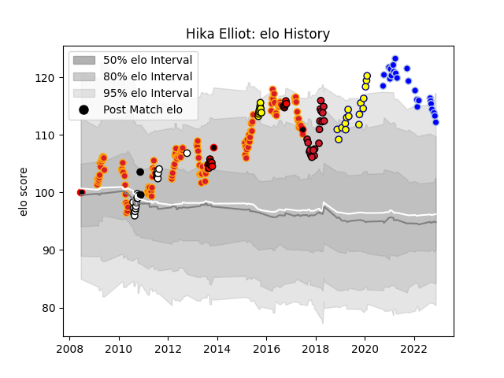

---  
layout: page  
title: Hika Elliot  
date: 2022-11-22 11:35:07.253586  
categories: player  
---
# Hika Elliot

## Positions: H

## Country: New Zealand Maori

## Current elo: 112.0

## Current Percentile: 93.0

# Elo History

# Match History

| Team              |   Appearances |   Win Rate |
|:------------------|--------------:|-----------:|
| Chiefs            |           117 |   0.645299 |
| Colomiers         |            24 |   0.541667 |
| Hawke's Bay       |            20 |   0.525    |
| Oyonnax           |            19 |   0.473684 |
| Nevers            |            16 |   0.625    |
| Counties Manukau  |            14 |   0.642857 |
| Taranaki          |             8 |   0.75     |
| New Zealand Maori |             4 |   0.75     |
| New Zealand       |             2 |   1        |

| Opponent                 |   Matches |   Win Rate |
|:-------------------------|----------:|-----------:|
| Hurricanes               |        13 |   0.576923 |
| Crusaders                |        13 |   0.538462 |
| Blues                    |        13 |   0.807692 |
| Highlanders              |        12 |   0.5      |
| Queensland Reds          |         8 |   0.5      |
| Sharks                   |         7 |   0.714286 |
| Stormers                 |         7 |   0.571429 |
| Bulls                    |         7 |   0.428571 |
| Western Force            |         7 |   1        |
| New South Wales Waratahs |         6 |   0.166667 |
| Tasman                   |         5 |   0        |
| Brumbies                 |         5 |   0.8      |
| Canterbury               |         5 |   0.5      |
| Cheetahs                 |         5 |   0.9      |
| Melbourne Rebels         |         5 |   0.8      |
| Manawatu                 |         4 |   0.5      |
| Lions                    |         4 |   1        |
| Waikato                  |         4 |   0.875    |
| Provence Rugby           |         4 |   1        |
| Wellington               |         4 |   0.25     |
| Otago                    |         3 |   0.666667 |
| Mont-de-Marsan           |         3 |   0.666667 |
| North Harbour            |         3 |   1        |
| Nevers                   |         3 |   0.666667 |
| Rouen                    |         3 |   0.666667 |
| Grenoble                 |         3 |   0.666667 |
| Southland                |         3 |   0.666667 |
| Carcassonne              |         3 |   0.666667 |
| Brive                    |         3 |   0.333333 |
| Vannes                   |         3 |   0.333333 |
| Bay of Plenty            |         3 |   0.666667 |
| Soyaux-Angouleme         |         2 |   0.5      |
| Perpignan                |         2 |   1        |
| Pau                      |         2 |   0        |
| Taranaki                 |         2 |   1        |
| Oyonnax                  |         2 |   0.5      |
| Northland                |         2 |   1        |
| Southern Kings           |         2 |   1        |
| Agen                     |         2 |   0.5      |
| Clermont Auvergne        |         2 |   0.75     |
| Counties Manukau         |         2 |   1        |
| Aurillac                 |         2 |   0.5      |
| Biarritz Olympique       |         2 |   0        |
| Bordeaux Begles          |         2 |   0.5      |
| British and Irish Lions  |         2 |   0        |
| Castres Olympique        |         2 |   0        |
| Montauban                |         2 |   0        |
| Colomiers                |         2 |   0.5      |
| Worcester Warriors       |         2 |   0.5      |
| Fiji                     |         1 |   1        |
| Japan                    |         1 |   1        |
| Auckland                 |         1 |   0.5      |
| Beziers                  |         1 |   1        |
| Massy                    |         1 |   1        |
| Lyon                     |         1 |   1        |
| US Bressane              |         1 |   0        |
| Toulon                   |         1 |   1        |
| Canada                   |         1 |   1        |
| Scotland                 |         1 |   1        |
| Sunwolves                |         1 |   1        |
| Jaguares                 |         1 |   1        |
| Stade Toulousain         |         1 |   0.5      |
| Stade Francais Paris     |         1 |   1        |
| Ireland                  |         1 |   1        |
| Hawke's Bay              |         1 |   1        |
| Montpellier Herault      |         1 |   0        |