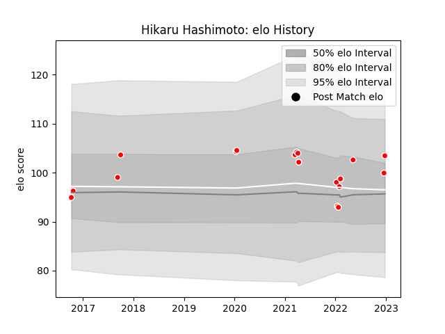

---  
layout: page  
title: Hikaru Hashimoto  
date: 2023-03-21 18:55:28.318786  
categories: player  
---
# Hikaru Hashimoto

Last updated: 2023-03-21
## Positions: FL

## Current elo: 136.0

## Current Percentile: 96.0

# Elo History

# Match History

| Team                  |   Appearances |   Win Rate |
|:----------------------|--------------:|-----------:|
| Kobelco Kobe Steelers |            37 |   0.689189 |

| Opponent                          |   Matches |   Win Rate |
|:----------------------------------|----------:|-----------:|
| Saitama Wild Knights              |         5 |   0.1      |
| Green Rockets Tokatsu             |         4 |   1        |
| Shizuoka Blue Revs                |         4 |   1        |
| Black Rams Tokyo                  |         3 |   0.666667 |
| Urayasu D-Rocks                   |         3 |   0.666667 |
| Kubota Spears Funabashi Tokyo-Bay |         3 |   0.333333 |
| Toshiba Brave Lupus Tokyo         |         2 |   1        |
| Yokohama Canon Eagles             |         2 |   0.5      |
| Munakata Sanix Blues              |         2 |   1        |
| Mitsubishi Dynaboars              |         2 |   1        |
| Mie Honda Heat                    |         1 |   1        |
| Tokyo Sungoliath                  |         1 |   0        |
| Hino Red Dolphins                 |         1 |   1        |
| Toyota Industries Shuttles Aichi  |         1 |   1        |
| Toyota Verblitz                   |         1 |   0        |
| Hanazono Kintetsu Liners          |         1 |   1        |
| NTT Docomo Red Hurricanes Osaka   |         1 |   1        |