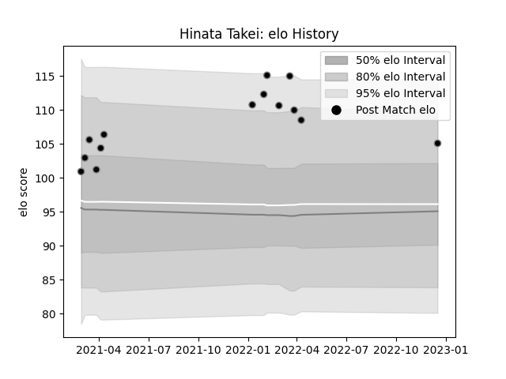

---  
layout: page  
title: Hinata Takei  
date: 2022-12-18 16:16:35.709985  
categories: player  
---
# Hinata Takei

## Positions: H

## Current elo: 105.0

## Current Percentile: 88.0

# Elo History

# Match History

| Team             |   Appearances |   Win Rate |
|:-----------------|--------------:|-----------:|
| Black Rams Tokyo |            14 |   0.285714 |

| Opponent                        |   Matches |   Win Rate |
|:--------------------------------|----------:|-----------:|
| NTT Docomo Red Hurricanes Osaka |         2 |        0.5 |
| Shizuoka Blue Revs              |         2 |        0.5 |
| Yokohama Canon Eagles           |         2 |        0   |
| Green Rockets Tokatsu           |         1 |        1   |
| Hino Red Dolphins               |         1 |        1   |
| Kobelco Kobe Steelers           |         1 |        0   |
| Mitsubishi Dynaboars            |         1 |        0   |
| Saitama Wild Knights            |         1 |        0   |
| Tokyo Sungoliath                |         1 |        0   |
| Toyota Verblitz                 |         1 |        0   |
| Urayasu D-Rocks                 |         1 |        0   |