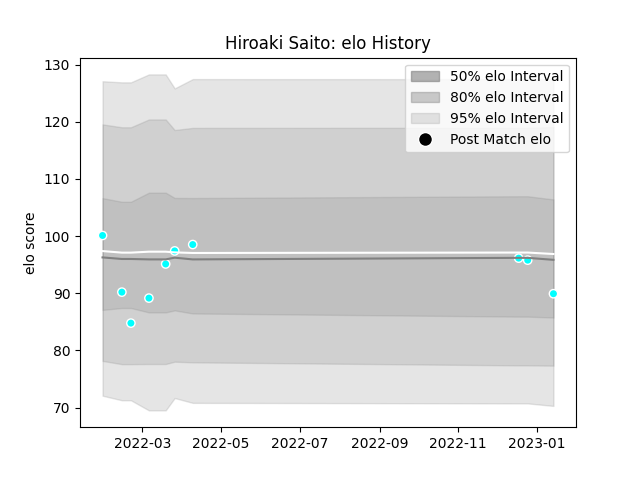

---  
layout: page  
title: Hiroaki Saito  
date: 2023-02-02 19:06:47.976327  
categories: player  
---
# Hiroaki Saito

## Positions: C, W

## Current elo: 95.0

## Current Percentile: 34.0

# Elo History

# Match History

| Team                             |   Appearances |   Win Rate |
|:---------------------------------|--------------:|-----------:|
| Toyota Industries Shuttles Aichi |            11 |   0.909091 |

| Opponent              |   Matches |   Win Rate |
|:----------------------|----------:|-----------:|
| Shimizu Blue Sharks   |         3 |          1 |
| Chugoku Red Regulions |         2 |          1 |
| Kyuden Voltex         |         2 |          1 |
| Hino Red Dolphins     |         1 |          1 |
| Kamaishi Seawaves     |         1 |          1 |
| Kurita Water Gush     |         1 |          1 |
| Urayasu D-Rocks       |         1 |          0 |