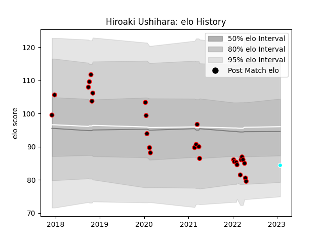

---  
layout: page  
title: Hiroaki Ushihara  
date: 2023-02-02 18:44:24.070831  
categories: player  
---
# Hiroaki Ushihara

## Positions: H

## Current elo: 84.0

## Current Percentile: 12.0

# Elo History

# Match History

| Team                             |   Appearances |   Win Rate |
|:---------------------------------|--------------:|-----------:|
| NTT Docomo Red Hurricanes Osaka  |            28 |   0.357143 |
| Toyota Industries Shuttles Aichi |             1 |   1        |

| Opponent                          |   Matches |   Win Rate |
|:----------------------------------|----------:|-----------:|
| Black Rams Tokyo                  |         3 |   0.333333 |
| Saitama Wild Knights              |         3 |   0        |
| Toshiba Brave Lupus Tokyo         |         3 |   0        |
| Shizuoka Blue Revs                |         3 |   0        |
| Tokyo Sungoliath                  |         2 |   0        |
| Yokohama Canon Eagles             |         2 |   0.5      |
| Kamaishi Seawaves                 |         2 |   1        |
| Green Rockets Tokatsu             |         2 |   1        |
| Kubota Spears Funabashi Tokyo-Bay |         1 |   0        |
| Kyuden Voltex                     |         1 |   1        |
| Chugoku Red Regulions             |         1 |   1        |
| Mitsubishi Dynaboars              |         1 |   1        |
| Munakata Sanix Blues              |         1 |   0        |
| Hino Red Dolphins                 |         1 |   1        |
| Hanazono Kintetsu Liners          |         1 |   0        |
| Toyota Verblitz                   |         1 |   0        |
| Mazda Blue Zoomers                |         1 |   1        |