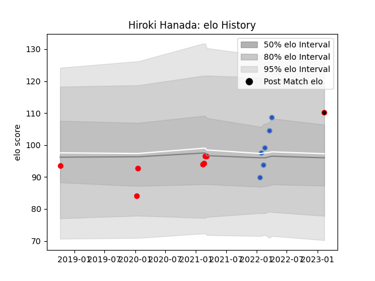

---  
layout: page  
title: Hiroki Hanada  
date: 2023-02-16 11:18:46.585159  
categories: player  
---
# Hiroki Hanada

## Positions: FL, N8

## Current elo: 110.0

## Current Percentile: 78.0

# Elo History

# Match History

| Team                            |   Appearances |   Win Rate |
|:--------------------------------|--------------:|-----------:|
| Coca-Cola Red Sparks            |             7 |   0.714286 |
| Munakata Sanix Blues            |             6 |   0.833333 |
| NTT Docomo Red Hurricanes Osaka |             1 |   1        |

| Opponent                         |   Matches |   Win Rate |
|:---------------------------------|----------:|-----------:|
| Kyuden Voltex                    |         4 |        1   |
| Chugoku Red Regulions            |         3 |        1   |
| Shimizu Blue Sharks              |         2 |        0.5 |
| Toyota Industries Shuttles Aichi |         2 |        0.5 |
| Kurita Water Gush                |         1 |        1   |
| Skyactivs Hiroshima              |         1 |        1   |
| Yokohama Canon Eagles            |         1 |        0   |