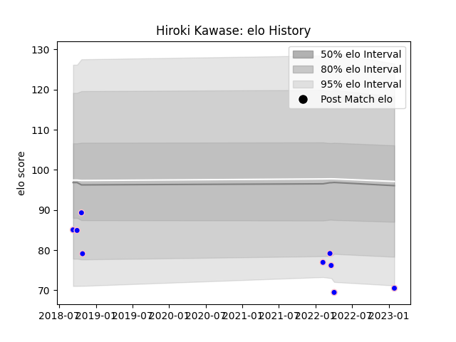

---  
layout: page  
title: Hiroki Kawase  
date: 2023-01-30 17:50:35.984543  
categories: player  
---
# Hiroki Kawase

## Positions: L, FL

## Current elo: 71.0

## Current Percentile: 3.0

# Elo History

# Match History

| Team              |   Appearances |   Win Rate |
|:------------------|--------------:|-----------:|
| Kurita Water Gush |             9 |   0.222222 |

| Opponent                         |   Matches |   Win Rate |
|:---------------------------------|----------:|-----------:|
| NTT Docomo Red Hurricanes Osaka  |         2 |        0.5 |
| Chugoku Red Regulions            |         1 |        0   |
| Hanazono Kintetsu Liners         |         1 |        0   |
| Mazda Blue Zoomers               |         1 |        1   |
| Mitsubishi Dynaboars             |         1 |        0   |
| Munakata Sanix Blues             |         1 |        0   |
| Shimizu Blue Sharks              |         1 |        0   |
| Toyota Industries Shuttles Aichi |         1 |        0   |